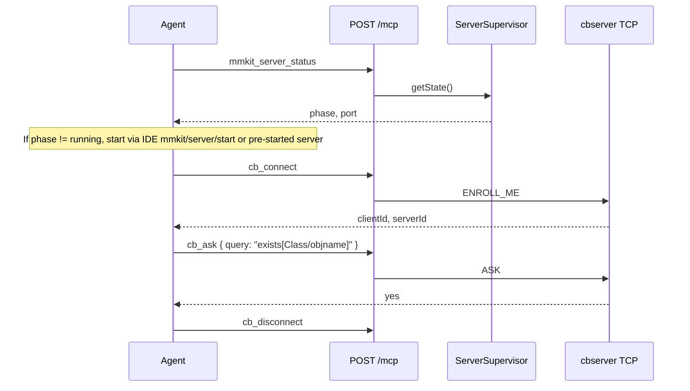

# mmkit MCP — AI agent guide

**Endpoint:** `POST http://<host>:28080/mcp` (Streamable HTTP)  
**Health:** `GET /healthz` · **Readiness:** `GET /readyz` (503 until LSP transport started)  
**Process:** single Node.js binary (`dist/server.js`) — LSP + MCP + cbserver manager

## Source layout (`packages/lsp-server/src/`)

| Section | Path | Responsibility |
| ------- | ---- | -------------- |
| **shared** | `shared/` | HTTP (`/healthz`, `/mcp`), OTEL, cbserver **ports** (process/docker/fs/network/assets) |
| **lsp** | `lsp/` | Language server: documents, tree-sitter, semantic tokens, `mmkit/*` router |
| **mcp** | `mcp/` | MCP tools, TCP client (`CbTcpClient`), argument validation |
| **cbserver** | `cbserver/` | mmkit server lifecycle actor + `ServerSupervisor` |

## Recommended workflow for agents



### 1. Check server

**Tool:** `mmkit_server_status`  
**Args:** none  
**Returns:** `{ phase, port, generation }` — `phase` must be `running` before TCP tools work against the internal server.

### 2. Connect

**Tool:** `cb_connect`  
**Args (all optional):**

| Field | Type | Default |
| ----- | ---- | ------- |
| `host` | string | `127.0.0.1` |
| `port` | integer | supervisor port |
| `toolName` | string | `mmkit-mcp` |
| `userName` | string | `mmkit` |

### 3. Query / mutate

| Tool | Java API | Required args | Frame validation |
| ---- | -------- | ------------- | ---------------- |
| `cb_ask` | `ask` | `query` | no |
| `cb_ask_objnames` | `askObjNames` | `query` | no |
| `cb_tell` | `tell` | `frames` | **tree-sitter** |
| `cb_untell` | `untell` | `frames` | **tree-sitter** |
| `cb_retell` | `retell` | `untellFrames`, `tellFrames` | **both** |
| `cb_hypo_ask` | `hypoAsk` | `frames`, `query`, `queryFormat` | frames validated |
| `cb_get_object` | `getObject` | `objname` | identifier pattern |
| `cb_tells` / `cb_untells` / `cb_asks` | simplified | see tool name | frames for tell/untell |

### 4. Disconnect

**Tool:** `cb_disconnect` — always call when done.

## Validation policy (malformed input)

All tools reject before TCP when:

- Arguments are not a JSON object
- Strings contain ASCII control characters
- Strings exceed 64 KiB (frames/transactions up to 512 KiB via dedicated limit)
- Ports outside 1–65535
- `queryFormat` not `OBJNAMES` or `FRAMES`
- **Frame tools:** ConceptBase source parsed with **tree-sitter** (or bracket fallback); syntax errors return `validation_failed` without hitting cbserver

Example validation error:

```json
{
  "ok": false,
  "error": "validation_failed",
  "message": "invalid ConceptBase frames: syntax errors in ConceptBase source (2 ERROR node(s))",
  "field": "frames"
}
```

## Smoke test against a real cbserver

```bash
cd components/mmkit/packages/lsp-server
npm run build

# Point at Nix-built cbserver (or dev binary)
export MMKIT_CBSERVER_BIN="$(nix build /path/to/conceptbase-cc#cbserver --print-out-paths 2>/dev/null)/bin/cbserver"
# Nix/native binaries skip Docker-style CB_HOME paths; probe allows ~60s boot (MMKIT_PORT_PROBE_*)
export MMKIT_LSP_TRANSPORT=tcp
export MMKIT_HTTP_PORT=28080
export MMKIT_LSP_PORT=16011

node dist/server.js &
sleep 2

# Health
curl -s http://127.0.0.1:28080/healthz

# Live smoke (starts cbserver via supervisor, ASK Class)
npm run smoke:mcp
```

Set `MMKIT_MCP_LIVE=1` to run the gated integration test in CI/dev.

## Tool catalog

See `mcp/mcp-tool-names.ts` — 28 tools mapping `ICBclient` (`cbapi`).

## Do not

- Send raw IPC `ipcmessage(...)` over MCP — use typed tools only
- Pass Docker commands — use executable mode (`launchKind: executable`)
- Assume `cb_connect` without checking `mmkit_server_status` when using the bundled server
