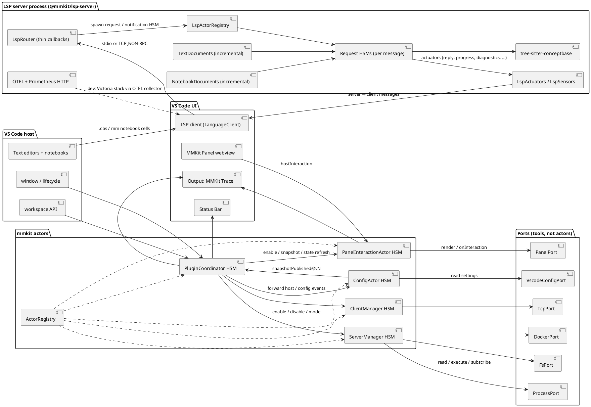
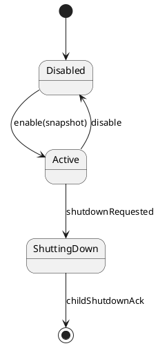
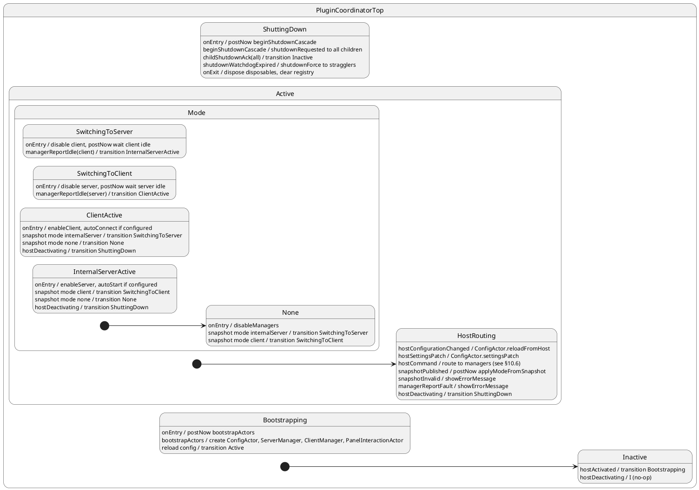
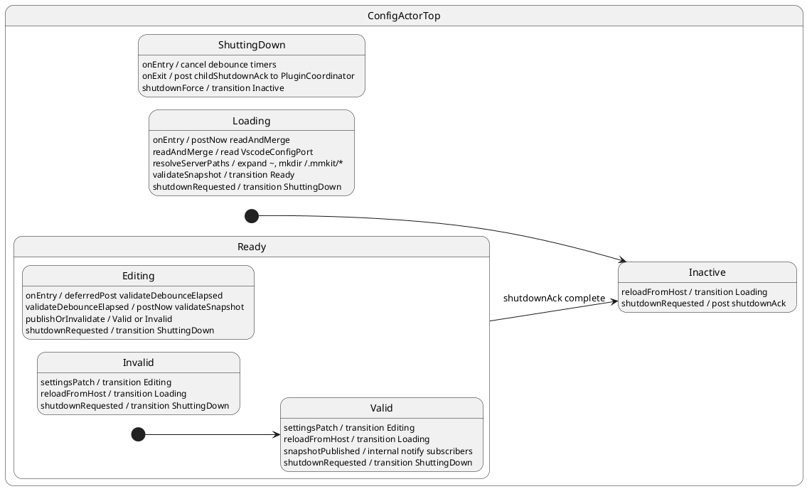
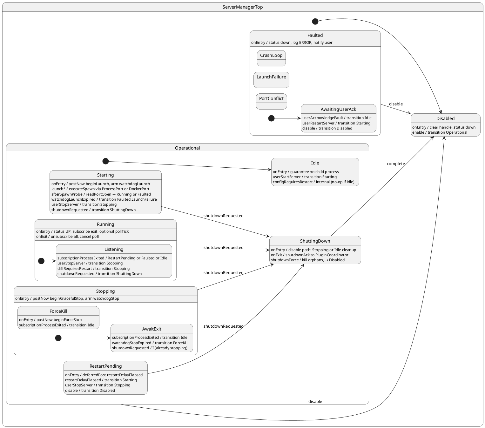
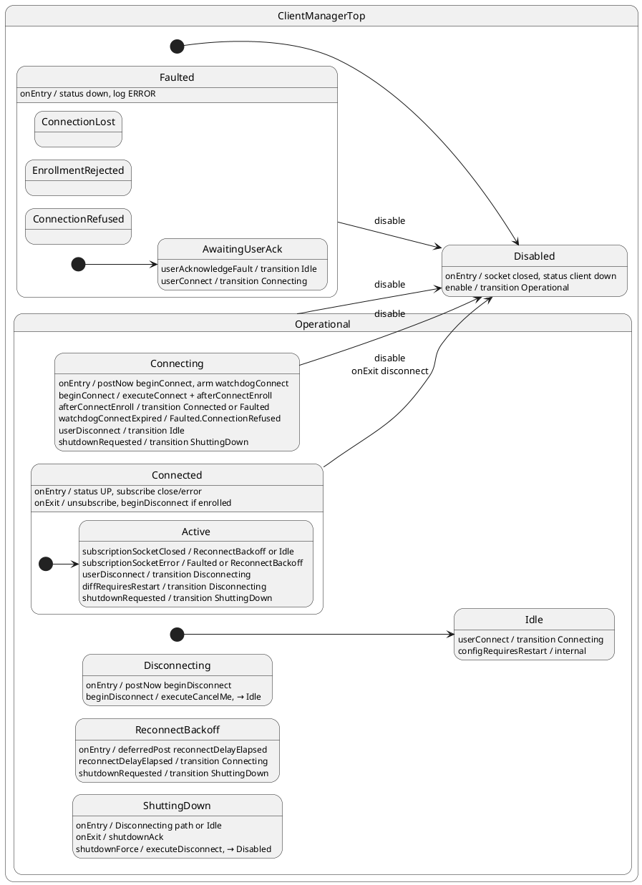
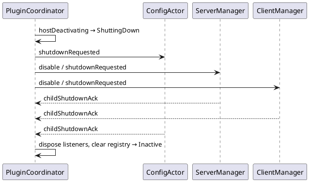
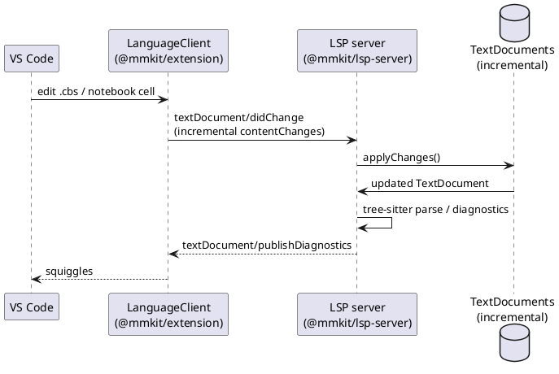
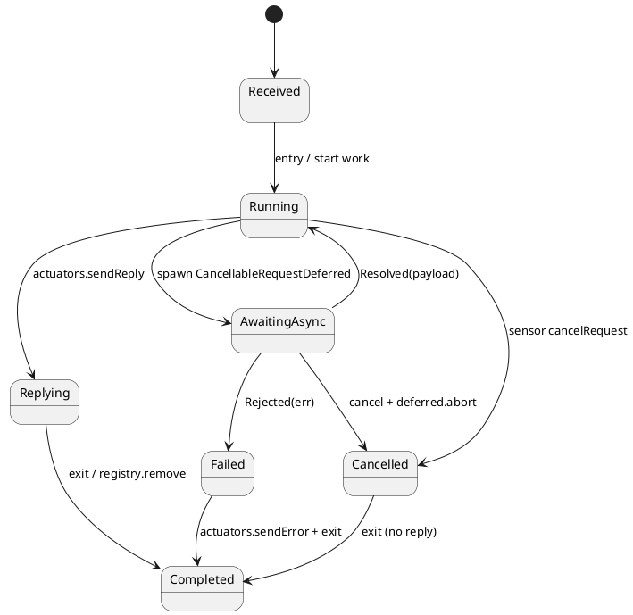

# mmkit Plugin — Design Specification

**Version:** 0.2.0-draft  
**Status:** cbserver actors + language tooling scaffold implemented; LSP per-request HSM layer specified (§20) — see [STATUS.md](./STATUS.md) and [PLAN.md](./PLAN.md)  
**Runtime:** VS Code extension (`components/mmkit`)  
**State-machine library:** [ihsm](https://github.com/filasieno/ihsm) (hierarchical state machines as TypeScript classes)

---

## Table of contents

1. [Purpose and scope](#1-purpose-and-scope)
2. [Meta-specification rating](#2-meta-specification-rating)
3. [Architecture overview](#3-architecture-overview)
4. [Property sheets](#4-property-sheets)
5. [Event storming](#5-event-storming)
6. [Actor model and registry](#6-actor-model-and-registry)
7. [Ports (read, execute, subscribe)](#7-ports-read-execute-subscribe)
8. [Logging and tracing](#8-logging-and-tracing)
9. [Status bar](#9-status-bar)
9a. [MMKit panel (PanelInteractionActor)](#9a-mmkit-panel-panelinteractionactor)
10. [PluginCoordinator state machine](#10-plugincoordinator-state-machine)
11. [ConfigActor state machine](#11-configactor-state-machine)
12. [ServerManager state machine](#12-servermanager-state-machine)
13. [ClientManager state machine](#13-clientmanager-state-machine)
14. [Extension shutdown](#14-extension-shutdown)
15. [Protocol matrices](#15-protocol-matrices)
16. [Testing strategy](#16-testing-strategy)
17. [VS Code integration map](#17-vs-code-integration-map)
18. [Implementation phases](#18-implementation-phases)
19. [ConceptBase language tooling (LSP, `.cbs`, notebook)](#19-conceptbase-language-tooling-lsp-cbs-notebook)
20. [LSP request / notification state machines](#20-lsp-request--notification-state-machines)

---

## 1. Purpose and scope

The **Metamodelling Kit (mmkit)** VS Code extension manages the lifecycle of a
**ConceptBase.cc cbserver**, **TCP client connections** to it, and **ConceptBase
language editing** (LSP client, LSP server, `.cbs` files, and MM notebooks).
All non-trivial lifecycle behaviour is expressed as **ihsm hierarchical state
machines** (actors), not as ad-hoc conditionals. Language-server I/O follows
the Microsoft **LSP sample** architecture (separate server process, incremental
`TextDocument` / notebook sync).

### Goals

| Goal | Mechanism |
| ---- | --------- |
| Reliable server lifecycle | `ServerManager` HSM with explicit entry/exit guarantees |
| Reliable client connectivity | `ClientManager` HSM |
| Single configuration surface | Property sheet mirroring `Containerfile` / entrypoint semantics |
| Deterministic tests | **Ports** (read / execute / subscribe) behind managers; sim ports for headless runs |
| Observable behaviour | **MMKit Trace** output channel, OTEL severities, user `mmkit.traceLevel`, ihsm trace |
| Composable actors | `ActorRegistry` + `PluginCoordinator` (root actor) + `PanelInteractionActor` |
| VS Code integration | `PluginCoordinator` — sole VS Code listener, mode orchestration, shutdown |
| Operator UI | Activity-bar **MMKit** webview panel (React) + status bar + command palette |
| ConceptBase editing | LSP client + forked **Microsoft reference** LSP server; `.cbs` language id; **MM notebook** (ConceptBase cells only) |
| Incremental documents | `TextDocumentSyncKind.Incremental` for buffers; full incremental notebook cell sync |

### Out of scope (v0.1)

- MCP integration (separate from LSP; future phase).
- Semantic features beyond parse/diagnostics until `tree-sitter-conceptbase` queries are wired (hover, completion, symbols are phased).
- Non-TCP transports (all CB I/O is TCP/IP).
- Editing database files on disk outside cbserver.
- Windows native cbserver (Linux executable or Docker only; aligns with user manual).

### Assumptions

1. **Mode selection:** exactly one operational mode is active at a time:
   **Internal server** or **Client**. Switching mode triggers coordinated
   shutdown of the inactive side (via `PluginCoordinator`).
2. **TCP only:** server listens on `CB_PORTNR`; client uses `host` + `port`.
3. **Property changes** while a manager is in a stable operational state either
   apply as **internal transitions** (safe fields) or force a controlled
   **restart transition** (unsafe fields — see §4.4).
4. **Language tooling** is orthogonal to cbserver lifecycle: LSP starts with the
   extension regardless of `operationalMode`; notebook cell execution (future)
   requires `ClientManager.Connected` but editing does not.

---

## 2. Meta-specification rating

The request (meta-specification) is evaluated against software-design quality
criteria for actor/HSM systems.

| Criterion | Score (1–5) | Notes |
| --------- | ----------- | ----- |
| Separation of concerns | 5 | Server vs client vs configuration clearly split |
| State-machine centrality | 5 | Explicit rejection of conditional spaghetti |
| Hierarchy / entry-exit | 5 | Correct ihsm idiom; matches reference manual |
| Event completeness | 4 | Requires explicit event-storming pass (§5) — provided here |
| Testability | 5 | Sensor/actuator abstraction specified |
| Observability | 4 | OTEL severities + trace; needs structured field schema (§8) |
| UI integration | 3 | Property sheet + status bar named; persistence scope unspecified in meta-spec |
| Failure modes | 4 | Crash, signals, port conflict implied; crash-loop policy added below |
| Protocol review per state | 5 | Explicit requirement — §13 delivers matrices |

**Overall: 4.4 / 5 (Excellent)** — The meta-specification is production-grade in
intent. Gaps closed in this document:

- Mutual exclusivity of server vs client mode.
- Classification of configuration fields into *hot*, *warm*, *cold* (restart required).
- Docker-specific actuators and health probes.
- Interaction with cbserver **slave** mode (auto shutdown when last client leaves).
- `postNow` pseudo-state pattern for multi-step extended transitions (ihsm §4).
- Explicit `FatalErrorState` recovery path per ihsm error model.

---

## 3. Architecture overview



### Dependency graph

```
extension.activate()  (@mmkit/extension)
  └─ construct Ports (real | sim) + MmkitLogHub → MMKit Trace channel
  └─ register WebviewViewProvider (mmkit.panel) → PanelPortBridge
  └─ register LanguageClient → docker compose observability stack (dev default) or direct stdio
  └─ register NotebookSerializer (mmkit.conceptbase-notebook)
  └─ register .cbs language + grammar contribution (conceptbase)
  └─ ActorRegistry.register(...)     — cbserver / panel actors only (§6)
  └─ PluginCoordinator (makeHsm)    — root actor; VS Code listeners; mode + shutdown
       ├─ ConfigActor               — load, validate, version snapshots
       ├─ ServerManager             — internal cbserver lifecycle (Installing substates)
       ├─ ClientManager             — TCP ENROLL_ME client lifecycle
       └─ PanelInteractionActor     — React panel ViewModel render + user interactions

@mmkit/lsp-server main()
  └─ init OpenTelemetry (logs, traces, metrics) → OTLP collector when configured
  └─ start telemetry HTTP (/healthz, /readyz, /metrics)
  └─ LspRouter registers connection handlers → spawn per-message HSM (§20, planned)
  └─ LspActorRegistry stores running request / notification machines

extension.deactivate()
  └─ LanguageClient.stop() + docker compose down (when launchKind = dockerCompose)
  └─ PluginCoordinator.hostDeactivating()  — ordered shutdown incl. panel ack (§14)
```

**Monorepo layout** (npm workspaces — see §19.2):

```
components/mmkit/
  package.json                 # workspaces root
  packages/
    extension/                 # @mmkit/extension — activate(), actors, panel
    lsp-server/                # @mmkit/lsp-server — fork of microsoft/lsp-sample server
    shared/                    # @mmkit/shared — language ids, notebook mime, protocol constants
```

**Control principle:** external systems do **not** push into managers by default.
Managers **pull** (`read*`), **command** (`execute*`), or **opt in** to push
(`subscribe` / `unsubscribe`) from state `onEntry` / `onExit`.

**ihsm usage rules (from reference manual):**

- States are **classes**; events are **Protocol methods**.
- External stimuli → `hsm.post('event', payload)`; handlers call `this.transition(Target)`.
- Multi-step atomic sequences inside one logical transition → chain of **`this.postNow(...)`** handlers so hi-priority work completes before deferred `post` side effects.
- **`onEntry` / `onExit`** provide guarantees (e.g. `Running.onExit` always stops process actuators).
- Orthogonal regions → **separate `makeHsm` instances** coordinated by **`PluginCoordinator`** (ihsm tutorial 14).
- Tests use **`sync()`** at boundaries; production uses `post` + optional `await sync()`.

---

## 4. Property sheets and VS Code settings

**Canonical reference:** [CONFIGURATION.md](./CONFIGURATION.md) — every setting id,
human-readable **title**, short **description**, and **markdownDescription** (tooltip /
settings detail pane).

Configuration uses VS Code `contributes.configuration` (Settings UI + `settings.json`).
The **MMKit activity-bar panel** (§9a) exposes lifecycle actions; full property editing
remains in Settings UI (`mmkit.openSettings`). A future property-sheet webview may
mirror the same `mmkit.*` keys (see [PLAN.md](./PLAN.md)).

### 4.1 Naming conventions

| Rule | Example |
| ---- | ------- |
| Extension prefix + camelCase | `mmkit.server.port` |
| No `CB_*` in setting ids | maps to `CB_PORTNR` in `ConfigSnapshot.toEnv()` |
| Three UI categories (array) | Metamodelling Kit · Server · Client |
| Default scope | `resource` (per workspace folder); **`mmkit.server.dataDir` uses `application`** (user home, not per-folder) |
| Empty string on path keys | `ConfigActor` applies derived default under `dataDir` (see CONFIGURATION.md) |
| Tilde expansion | `~/.mmkit` → `os.homedir() + '/.mmkit'` at snapshot build |

Legacy draft keys (`internal.*`, `CB_PORTNR` as id) are **replaced** by the table
in CONFIGURATION.md.

### 4.2 Setting inventory (summary)

| Category | Prefix | Count |
| -------- | ------ | ----- |
| General | `mmkit.operationalMode`, `mmkit.traceLevel` | 2 |
| Server (launch, data dir, paths, database, runtime) | `mmkit.server.*` | 45 |
| Client | `mmkit.client.*` | 8 |

Removed as a separate setting: `CB_DB_DIR` (alias of `CB_DATABASE` — use
`mmkit.server.databasePath` only).

### 4.3 ConfigActor (not per-field)

One **`ConfigActor` HSM** (§11) + **`config-schema.ts`** metadata per field.
`PluginCoordinator` forwards host configuration events; managers consume versioned
`snapshotPublished` only. See CONFIGURATION.md.

### 4.4 Configuration change classification

| Class | Examples | Behaviour while `ServerManager.Running` / `ClientManager.Connected` |
| ----- | -------- | ------------------------------------------------------------------- |
| **Hot** | `mmkit.server.traceMode`, `mmkit.client.toolName` (before connect) | Internal transition; snapshot version bump only. |
| **Warm** | `mmkit.server.port`, `mmkit.client.port`, `mmkit.server.databasePath` | `configRequiresRestart` → stop → apply → optional auto-start/connect. |
| **Cold** | `mmkit.operationalMode`, `mmkit.server.launchKind` | `PluginCoordinator` mode substate switch (§10). |

`ConfigActor` validates mutual exclusion (`newDatabasePath` vs `databasePath` vs
`databaseAllPath`), path existence where checkable, and port range before emitting
`configValid` / `configInvalid`.

---

## 5. Event storming

Two layers:

1. **Ports** — synchronous/async **tools** (`read*`, `execute*`, `subscribe` /
   `unsubscribe`). Ports do **not** own behaviour and do **not** post to actors
   unless the actor has called `subscribe` for a topic.
2. **HSM Protocol events** — mailbox messages on actors. Includes user intent,
   `PluginCoordinator` forwards, subscription deliveries, timers, and cross-actor signals.

### 5.1 VS Code host events (ingested by PluginCoordinator only)

| Host signal | Normalized event | Handled by |
| ----------- | ---------------- | ---------- |
| `activate(context)` | `hostActivated` | `PluginCoordinator` → bootstrap child actors |
| `deactivate()` | `hostDeactivating` | `PluginCoordinator` → §14 shutdown |
| `workspace.onDidChangeConfiguration` | `hostConfigurationChanged` | `PluginCoordinator` → `ConfigActor.reloadFromHost` |
| `workspace.onDidChangeWorkspaceFolders` | `hostWorkspaceFoldersChanged` | `PluginCoordinator` → `ConfigActor` |
| `window.onDidChangeWindowState` | `hostWindowStateChanged` | `PluginCoordinator` (optional reconcile) |
| Command palette / webview / status bar click | `hostCommand` | `PluginCoordinator` → route by command id |
| Property sheet edit | `hostSettingsPatch` | `PluginCoordinator` → `ConfigActor` |
| Extension development reload | `hostDeactivating` | same as close |

**Rule:** no actor other than **`PluginCoordinator`** registers VS Code API listeners.

### 5.2 User / UI events (routed via PluginCoordinator)

| Event | Payload | Posted to |
| ----- | ------- | --------- |
| `userStartServer` | — | `ServerManager` |
| `userStopServer` | — | `ServerManager` |
| `userRestartServer` | — | `ServerManager` |
| `userConnect` | — | `ClientManager` |
| `userDisconnect` | — | `ClientManager` |
| `userAcknowledgeFault` | — | `ServerManager` / `ClientManager` |
| `userOperationalMode` | `Mode` | `PluginCoordinator` (mode substate) |

### 5.3 ConfigActor events

| Event | Payload | Posted to |
| ----- | ------- | --------- |
| `reloadFromHost` | `resource` | `ConfigActor` (internal) |
| `settingsPatch` | `Partial<RawSettings>` | `ConfigActor` |
| `validateNow` | — | `ConfigActor` (`postNow` chain) |
| `snapshotPublished` | `ConfigSnapshot` | `PluginCoordinator`, managers |
| `snapshotInvalid` | `ValidationError[]` | UI via `PluginCoordinator` |
| `diffRequiresRestart` | `keys[]` | active manager |
| `shutdownAck` | — | `PluginCoordinator` |

### 5.4 Port operations (not Protocol events — `call()` / direct read)

Invoked **from state handlers**; results drive transitions or `postNow` chains.

| Port | Read | Execute | Subscribe topics |
| ---- | ---- | ------- | ---------------- |
| `ProcessPort` | `readExitStatus(handle)`, `drainStdout(handle)` | `executeSpawn(spec)`, `executeStop(handle, signal)` | `exit`, `stdoutLine` |
| `DockerPort` | `readContainerState(id)`, `drainLogs(id)` | `executeRun(spec)`, `executeStop(id)` | `exit`, `logLine` |
| `NetworkPort` | `readPortOpen(host, port)` | — | — |
| `FsPort` | `readPathExists(path)`, `readLockFile(dbPath)` | — | — |
| `TcpPort` | `readSocketState(handle)` | `executeConnect(...)`, `executeEnroll(...)`, `executeCancelMe(...)` | `close`, `error` |
| `VscodeConfigPort` | `readConfiguration(resource)` | `executeUpdate(key, value)` | — |

### 5.5 Subscription delivery events (posted only while subscribed)

Registered in parent state `onEntry`; **must** `unsubscribe` in `onExit`.

| Event | Payload | When subscribed |
| ----- | ------- | --------------- |
| `subscriptionProcessExited` | `ExitInfo` | `Running.Listening` |
| `subscriptionStdoutLine` | `string` | optional debug |
| `subscriptionSocketClosed` | — | `Connected.Active` |
| `subscriptionSocketError` | `Error` | `Connected.Active` |

### 5.6 PluginCoordinator ↔ manager events

| Event | Payload | Posted to |
| ----- | ------- | --------- |
| `snapshotPublished` | `ConfigSnapshot` | `PluginCoordinator` → apply mode; forward to managers |
| `enableServer` | — | `ServerManager.enable` |
| `enableClient` | — | `ClientManager.enable` |
| `disableManagers` | — | both managers |
| `managerReportIdle` | `actorId` | `PluginCoordinator` (mode switch handshake) |
| `managerReportFault` | `FaultInfo` | `PluginCoordinator` → UI |
| `peerLocalServerStopped` | — | `ClientManager` |

### 5.7 Timer events (`deferredPost` inside actors)

| Event | Purpose |
| ----- | ------- |
| `watchdogLaunchExpired` | Starting timeout |
| `watchdogStopExpired` | Graceful stop → force kill |
| `restartDelayElapsed` | Crash restart backoff |
| `reconnectDelayElapsed` | Client reconnect |
| `pollTick` | Optional pull reconcile while Running/Connected |
| `validateDebounceElapsed` | ConfigActor batch validation |

### 5.8 Shutdown events (all actors)

| Event | Posted to | Meaning |
| ----- | --------- | ------- |
| `shutdownRequested` | ConfigActor, ServerManager, ClientManager | Begin teardown; no new work |
| `shutdownForce` | all child actors | Timeout elapsed; best-effort cleanup |
| `shutdownAck` | `PluginCoordinator` | Child idle and ports unsubscribed |

See §14.

### 5.9 ihsm infrastructure

`EventHandlerError`, `UnhandledEventError`, `TransitionError` → `onError` →
`Faulted` or `FatalErrorState`. During `shutdownRequested`, unhandled events are
logged at WARN and ignored (no new faults).

---

## 6. Actor model and registry

### 6.1 ActorRegistry

```typescript
interface ActorRegistry {
  register(id: string, hsm: Hsm<unknown, unknown>, meta: ActorMeta): void;
  unregister(id: string): void;
  get(id: string): Hsm<unknown, unknown> | undefined;
  list(): ActorRecord[];
  postTo(id: string, event: string, ...payload: unknown[]): void;
}
```

| Actor ID | HSM | Role |
| -------- | --- | ---- |
| `plugin.coordinator` | `PluginCoordinator` | Root actor: VS Code listeners, mode orchestration, shutdown, status bar, panel routing |
| `config` | `ConfigActor` | Load, validate, version snapshots; hot/warm/cold diff |
| `server.manager` | `ServerManager` | cbserver lifecycle (Docker / executable install pipeline) |
| `client.manager` | `ClientManager` | TCP client lifecycle |
| `panel.interaction` | `PanelInteractionActor` | MMKit sidebar panel: ViewModel render, interaction events |

Registration: `PluginCoordinator` first in `activate()`; children created during
`Bootstrapping`. Unregistration after all `shutdownAck` in `deactivate()`.

### 6.2 Startup order

1. Construct **Ports** (inject into `ctx.ports` on each actor).
2. `PluginCoordinator` → `hostActivated` → `Bootstrapping` → register child actors.
3. `ConfigActor.reloadFromHost` → `snapshotPublished`.
4. `PluginCoordinator` applies `operationalMode` (mode substate, §10).
5. Optional auto-start / auto-connect.

---

## 7. Ports (read, execute, subscribe)

Ports are **tools**, not actors. They have **no** mailbox and **no** ihsm state.
State machines **pull** facts, **execute** commands, and optionally **subscribe**
to push topics for the duration of a stable state.

> **Implementation note (v0.1):** The interfaces below are the **target** port model
> (`read*` / `execute*` / `subscribe`). The shipped code in `src/ports/types.ts` uses a
> pragmatic subset — e.g. `ProcessPort.onExit` instead of generic subscription tokens,
> `NetworkPort.probe` instead of `readPortOpen`, plus `AssetPort`, `UiPort`, and
> `PanelPort`. Behaviour matches this design; naming and subscribe tokens are deferred
> to [PLAN.md](./PLAN.md) §2.4. See [STATUS.md](./STATUS.md) gaps table.

### 7.1 Why the reactive model was wrong

Push callbacks (`onExit`, `onClose`, …) wired at adapter construction time:

- bypass the mailbox ordering guarantees;
- fire when the HSM is in the wrong state;
- make tests depend on timing instead of explicit `post` sequences.

**Correct pattern:** the HSM decides *when* to listen by calling `subscribe` in
`onEntry` and `unsubscribe` in `onExit`. Between pushes, the HSM may **read**
state on `pollTick` or after `execute*` completes.

### 7.2 Port surface

```typescript
type SubscriptionTopic = string;
type SubscriptionToken = symbol;

interface PortSubscription {
  topic: SubscriptionTopic;
  token: SubscriptionToken;
  deliver: (event: string, payload: unknown) => void; // posts into owning HSM
}

interface ProcessPort {
  // Read (pull)
  readExitStatus(handle: ProcessHandle): ExitInfo | null;
  drainStdout(handle: ProcessHandle): string[];
  // Execute (command)
  executeSpawn(spec: ExecutableLaunchSpec): Promise<SpawnResult>;
  executeStop(handle: ProcessHandle, signal?: NodeJS.Signals): Promise<void>;
  // Subscribe (opt-in push)
  subscribe(handle: ProcessHandle, topic: 'exit' | 'stdoutLine', deliver: PortSubscription['deliver']): SubscriptionToken;
  unsubscribe(token: SubscriptionToken): void;
}

interface NetworkPort {
  readPortOpen(host: string, port: number): Promise<boolean>;
}

interface TcpPort {
  readSocketState(handle: SocketHandle): 'open' | 'closed' | 'error';
  executeConnect(host: string, port: number, timeoutMs: number): Promise<SocketHandle>;
  executeEnroll(handle: SocketHandle, tool: string, user: string): Promise<EnrollResult>;
  executeCancelMe(handle: SocketHandle): Promise<void>;
  executeDisconnect(handle: SocketHandle): Promise<void>;
  subscribe(handle: SocketHandle, topic: 'close' | 'error', deliver: PortSubscription['deliver']): SubscriptionToken;
  unsubscribe(token: SubscriptionToken): void;
}

interface FsPort {
  readPathExists(path: string): Promise<boolean>;
  readLockFile(databasePath: string): Promise<string | null>;
}

interface VscodeConfigPort {
  readConfiguration(resource?: Uri): RawMmkitSettings;
  executeUpdate(resource: Uri | undefined, patch: Partial<RawMmkitSettings>): Promise<void>;
}

interface MmkitPorts {
  vscodeConfig: VscodeConfigPort;
  fs: FsPort;
  assets: AssetPort;       // bundled cbserver materialize (install pipeline)
  ui: UiPort;              // install progress notification
  process: ProcessPort;
  docker: DockerPort;
  network: NetworkPort;
  tcp: TcpPort;
  panel: PanelPort;        // §9a — webview render + hostInteraction sensor
}
```

`DockerPort` mirrors `ProcessPort` (`executeRun`, `readContainerState`, …).
`AssetPort` and `UiPort` support the `Installing*` substates (§12).

### 7.3 Using ports from state handlers

**Execute + transition** (ihsm `async` handler or `call` service):

```typescript
async launchExecutable(): Promise<void> {
  try {
    const result = await this.ctx.ports.process.executeSpawn(this.ctx.launchSpec);
    this.ctx.handle = result.handle;
    this.postNow('afterSpawnProbe');
  } catch (err) {
    this.transition(Faulted.LaunchFailure);
  }
}

async afterSpawnProbe(): Promise<void> {
  const open = await this.ctx.ports.network.readPortOpen('127.0.0.1', this.ctx.config.port);
  if (open) this.transition(Running);
  else this.transition(Faulted.PortConflict);
}
```

**Subscribe in `onEntry` / unsubscribe in `onExit`:**

```typescript
class Listening extends Running {
  private exitSub?: SubscriptionToken;

  onEntry(): void {
    if (this.ctx.handle) {
      this.exitSub = this.ctx.ports.process.subscribe(
        this.ctx.handle, 'exit',
        (ev, payload) => this.post('subscriptionProcessExited', payload as ExitInfo)
      );
    }
  }

  onExit(): void {
    if (this.exitSub) this.ctx.ports.process.unsubscribe(this.exitSub);
  }
}
```

### 7.4 Sim ports (testing)

`SimPorts` implements the same interfaces with an in-memory script:

```typescript
sim.process.scriptSpawn({ ok: true, handle: 'h1' });
sim.process.scriptExit('h1', { code: 1, signal: null }); // delivered only if subscribed
```

Tests never use real timers or sockets; they advance the script and `await hsm.sync()`.

---

## 8. Logging and tracing

### 8.1 Output channel

- **Name:** `MMKit Trace` (constant `TRACE_CHANNEL_NAME` in `logging/trace.ts`)
- **Location:** VS Code Output panel (dedicated channel)
- **Command:** `mmkit.showTrace` — focus the channel

### 8.2 User-configurable trace level

| Setting | Type | Default | Purpose |
| ------- | ---- | ------- | ------- |
| `mmkit.traceLevel` | `trace` \| `debug` \| `info` \| `warn` \| `error` \| `off` | `info` | Minimum OTEL severity written to MMKit Trace |

On change, `extension.activate` / `onDidChangeConfiguration` posts `traceLevelChanged`
to `PluginCoordinator`, which calls `ActorRegistry.applyTraceLevel(level)`:

1. Updates `MmkitLogHub` min severity (filters structured log lines).
2. Sets ihsm `traceLevel` on every registered actor (`VERBOSE_DEBUG` / `DEBUG` / `PRODUCTION` mapping).

**Every top state** (`CoordinatorTop`, `ConfigTop`, `ServerTop`, `ClientTop`, `PanelTop`)
implements `traceLevelChanged(level)` — coordinator fans the event to children for
per-actor trace context; coordinator applies the registry update.

Environment override: `MMKIT_VERBOSE_HSM=1` forces ihsm `VERBOSE_DEBUG` at construction
(development only).

### 8.3 OTEL-like severity mapping

| Severity | Usage |
| -------- | ----- |
| `TRACE` | ihsm `VERBOSE_DEBUG` trace lines, state entry/exit |
| `DEBUG` | ihsm `DEBUG`, port read/execute/subscribe boundaries |
| `INFO` | Successful transitions, connect/disconnect |
| `WARN` | `lockFilePresent`, degraded health, reconnect attempt |
| `ERROR` | `spawnFailed`, `enrollRejected`, unhandled protocol |
| `FATAL` | `FatalErrorState`, extension shutdown aborted |

Log line format (structured JSON optional behind setting):

```
2026-06-07T12:00:00.000Z INFO  [server.manager] Running.Listening: port probe ok port=4001
```

### 8.4 State-machine trace

Each HSM is constructed with:

```typescript
makeHsm(
  ServerManagerTop,
  ctx,
  true, // initialize
  TraceLevel.DEBUG,
  mmkitTraceWriter, // implements ihsm TraceWriter → Output channel
  dispatchErrorCallback
);
```

Trace lines are prefixed with actor id: `server.manager|…|Starting.AwaitReady: …`.

---

## 9. Status bar

Two icons in the VS Code status bar (right cluster):

| Item | ID | Visible when | Icon state |
| ---- | -- | ------------ | ---------- |
| Internal server | `mmkit.status.server` | `operationalMode === internalServer` | ● green = `ServerManager` ∈ `Running.*`; ● red/empty = otherwise |
| mmkit client | `mmkit.status.client` | `operationalMode === client` | ● green = `ClientManager` ∈ `Connected.*`; ● red/empty = otherwise |

Tooltip shows leaf state name + host:port. Click → `mmkit.openSettings` (implemented).

**Guarantee:** status bar updates only from `PluginCoordinator` on snapshot and
`managerReportIdle` — never from ports directly.

---

## 9a. MMKit panel (PanelInteractionActor)

Sidebar **activity-bar** view (`contributes.viewsContainers.activitybar` id `mmkit`,
icon `media/mmkit.svg`, webview `mmkit.panel`). Primary operator control for
start/stop (internal server) and connect/disconnect (client mode).

### 9a.1 Separation: ViewModel vs interaction

| Layer | Responsibility | Testability |
| ----- | -------------- | ----------- |
| `buildPanelViewModel()` | Pure function: snapshot + manager leaf states → `PanelViewModel` | Unit tests, no VS Code |
| `PanelComponent` (React) | Pure functional render from `PanelViewModel`; callbacks only | Webview bundle |
| `PanelInteractionActor` | HSM: subscribe port, push ViewModel, forward interactions | Sim `PanelPort` + fault injection |
| `PluginCoordinator` | Maps `panelInteraction` → `hostCommand` / server / client posts | Coordinator tests |

```typescript
interface PanelViewModel {
  title: string;
  operationalMode: OperationalMode;
  serverState: string;
  clientState: string;
  snapshotValid: boolean;
  port: number;
  host: string;
  traceLevel: OtelTraceLevel;
  actions: PanelActionViewModel[];
  statusMessage: string;
}

interface PanelInteraction {
  kind: 'click' | 'keydown';
  actionId: string;
  key?: string;
}
```

### 9a.2 PanelPort (sensor / actuator)

```typescript
interface PanelPort {
  render(viewModel: PanelViewModel): Promise<void>;           // actuator
  onInteraction(handler: (i: PanelInteraction) => void): () => void;  // sensor
  isVisible(): boolean;                                        // sensor (read)
}
```

- **Real:** `RealPanelPort` + `MmkitPanelProvider` (`WebviewViewProvider`) — postMessage ↔ React.
- **Sim:** `SimPanelPort` — stores `lastViewModel`, `simulateInteraction()` for tests.

### 9a.3 PanelInteractionActor statechart



| State | onEntry | Key events |
| ----- | ------- | ---------- |
| `Disabled` | clear interaction subscription | `enable` → `Active` |
| `Active` | `postNow subscribeHost`; `postNow renderViewModel` | `snapshotUpdated`, `managerStateUpdated`, `traceLevelChanged` → re-render; `hostInteraction` → coordinator |
| `ShuttingDown` | unsubscribe; `childShutdownAck` | `shutdownForce` noop |

Async render failures post `managerReportFault` — panel stays `Active` (no `FatalErrorState`).

### 9a.4 Event storming (panel)

| Event | Source | Handler |
| ----- | ------ | ------- |
| `enable` | Coordinator (mode side effects) | `Disabled` → `Active` |
| `snapshotUpdated` | Coordinator | Update ctx, re-render |
| `managerStateUpdated` | Coordinator (`refreshPanelStates`) | Update server/client leaf names, re-render |
| `hostInteraction` | PanelPort (webview click/key) | `panelInteraction` → coordinator |
| `traceLevelChanged` | Coordinator fan-out | Update ViewModel trace line |
| `panel.render` fault | PanelPort actuator | `managerReportFault`, remain `Active` |

---

## 10. PluginCoordinator state machine

**Root actor.** Sole registrant of VS Code API listeners. Responsibilities merged
from the former Supervisor + PluginCoordinator:

- bootstrap child actors (`ConfigActor`, `ServerManager`, `ClientManager`, `PanelInteractionActor`);
- route host / user events;
- enforce **operational mode** exclusivity (`none` | `internalServer` | `client`);
- own **extension shutdown** (§14);
- update status bar.

### 10.1 Context

```typescript
interface PluginCoordinatorCtx {
  ports: MmkitPorts;
  registry: ActorRegistry;
  extensionContext?: ExtensionContext;
  disposables: Disposable[];
  snapshot?: ConfigSnapshot;
  mode: 'none' | 'internalServer' | 'client';
  shutdown?: { reason: ShutdownReason; deadline: number; pendingAcks: Set<string> };
}
```

### 10.2 Protocol

```typescript
interface PluginCoordinatorProtocol {
  // VS Code host
  hostActivated(context: ExtensionContext): void;
  hostDeactivating(): void;
  hostConfigurationChanged(e: ConfigurationChangeEvent): void;
  hostWorkspaceFoldersChanged(e: WorkspaceFoldersChangeEvent): void;
  hostCommand(commandId: string): void;
  hostSettingsPatch(patch: Partial<RawMmkitSettings>): void;
  // Config / managers
  snapshotPublished(snapshot: ConfigSnapshot): void;
  snapshotInvalid(errors: ValidationError[]): void;
  managerReportIdle(actorId: string): void;
  managerReportFault(report: FaultInfo): void;
  childShutdownAck(actorId: string): void;
  shutdownWatchdogExpired(): void;
  // Panel (§9a)
  panelInteraction(interaction: PanelInteraction): void;
  traceLevelChanged(level: OtelTraceLevel): void;
  // postNow
  bootstrapActors(): void;
  refreshPanelStates(): void;
  applyModeFromSnapshot(): void;
  beginModeSwitch(target: Mode): void;
  beginShutdownCascade(): void;
}
```

### 10.3 Statechart



### 10.4 Entry/exit guarantees

| State | onEntry | onExit |
| ----- | ------- | ------ |
| `Inactive` | No children; all `Disposable`s disposed | — |
| `Bootstrapping` | — | Child actors registered; host listeners attached |
| `Active.HostRouting` | — | — |
| `Mode.None` | `disableManagers` | — |
| `Mode.InternalServerActive` | `enableServer`; status bar server visible | — |
| `Mode.ClientActive` | `enableClient`; status bar client visible | — |
| `Mode.Switching*` | disable outgoing side | — |
| `ShuttingDown` | cascade + global watchdog | registry cleared; extension may return from `deactivate()` |

### 10.5 Mode switch (`postNow` chain)

1. `snapshotPublished` with changed `operationalMode` → `postNow('applyModeFromSnapshot')`.
2. `applyModeFromSnapshot` → `transition(SwitchingToClient|SwitchingToServer|None|…)`.
3. Switching state waits for `managerReportIdle` from disabled manager before entering target mode.

Cold field changes (`launchKind`) follow the same disable → apply → enable path.

### 10.6 Command routing (`hostCommand`)

| Command id | Target event |
| ---------- | ------------- |
| `mmkit.startServer` | `userStartServer` → `ServerManager` |
| `mmkit.stopServer` | `userStopServer` |
| `mmkit.connect` | `userConnect` → `ClientManager` |
| `mmkit.disconnect` | `userDisconnect` |
| `mmkit.openSettings` | open Settings UI `@ext:conceptbase.mmkit` |

### 10.7 Protocol matrix (stable states)

| Event | Inactive | Bootstrapping | HostRouting | Mode.* | Switching* | ShuttingDown |
| ----- | -------- | ------------- | ----------- | ------ | ---------- | ------------ |
| `hostActivated` | H→Boot | I | — | — | — | — |
| `hostDeactivating` | I | H→Shut | H→Shut | H→Shut | H→Shut | I |
| `hostConfigurationChanged` | — | I | H→Config | I | I | I |
| `hostCommand` | — | — | H route | H route | I | I |
| `snapshotPublished` | — | I | H→apply mode | I | I | I |
| `managerReportIdle` | — | — | — | I | H→target | I |
| `childShutdownAck` | — | — | — | — | — | H→Inactive |
| `shutdownWatchdogExpired` | — | H force | H force | H force | H force | H force |

---

## 11. ConfigActor state machine

Single actor for **all** configuration interaction (not per-field actors).
Owns versioned `ConfigSnapshot` data; managers react to `snapshotPublished@vN`.

### 11.1 Context

```typescript
interface ConfigActorCtx {
  ports: MmkitPorts;
  resource?: Uri;
  raw?: RawMmkitSettings;
  snapshot?: ConfigSnapshot;
  generation: number;
  validationErrors: ValidationError[];
  pendingPatch?: Partial<RawMmkitSettings>;
  shutdownRequested: boolean;
}
```

### 11.2 Protocol

```typescript
interface ConfigActorProtocol {
  reloadFromHost(resource?: Uri): void;
  settingsPatch(patch: Partial<RawMmkitSettings>): void;
  validateDebounceElapsed(): void;
  snapshotRequested(): void;
  shutdownRequested(): void;
  shutdownForce(): void;
  // postNow
  readAndMerge(): void;
  resolveServerPaths(): void;
  validateSnapshot(): void;
  publishOrInvalidate(): void;
}
```

### 11.3 Statechart



### 11.4 Publish pipeline (`postNow` chain)

1. `readAndMerge` — `ports.vscodeConfig.readConfiguration(resource)` + merge pending patch.
2. `resolveServerPaths` — expand `~`; default `dataDir` to `~/.mmkit`; derive
   `databaseAllPath` → `${dataDir}/workspace`, `tmpDir` → `${dataDir}/tmp`;
   `FsPort` creates missing directories.
3. `validateSnapshot` — pure `validateSnapshot(resolved)` → errors[].
4. `publishOrInvalidate`:
   - if valid → `generation++`, build `ConfigSnapshot` (absolute paths), `post('snapshotPublished', snapshot)` to registry subscribers;
   - compute `diffRequiresRestart` vs previous (hot/warm/cold from schema);
   - if invalid → `snapshotInvalid` → PluginCoordinator shows problems panel.

**Internal server disk default:** `~/.mmkit/workspace` (`CB_DB_ALL`), persistency
`persistent`, tmp `~/.mmkit/tmp` — see CONFIGURATION.md *Home data directory*.

### 11.5 Shutdown behaviour

| State | `shutdownRequested` | `shutdownForce` |
| ----- | ------------------- | --------------- |
| `Inactive` | `shutdownAck` immediately | → `Inactive` |
| `Loading` | → `ShuttingDown` (abort load) | → `Inactive` |
| `Valid` / `Invalid` | → `ShuttingDown` | → `Inactive` |
| `Editing` | → `ShuttingDown` (drop pending patch) | → `Inactive` |
| `ShuttingDown` | ignore | → `Inactive` |

`onExit` of `ShuttingDown`: `PluginCoordinator.childShutdownAck('config')`.

### 11.6 Protocol matrix (stable states)

| Event | Inactive | Valid | Invalid | Editing | ShuttingDown |
| ----- | -------- | ----- | ------- | ------- | ------------ |
| `reloadFromHost` | H→Loading | H→Loading | H→Loading | I | — |
| `settingsPatch` | — | H→Editing | H→Editing | I (reset debounce) | — |
| `validateDebounceElapsed` | — | — | — | H (`postNow` chain) | — |
| `shutdownRequested` | H ack | H→ShuttingDown | H→ShuttingDown | H→ShuttingDown | I |
| `shutdownForce` | H | H | H | H | H→Inactive |

---

## 12. ServerManager state machine

### 12.1 Context (`ServerManagerCtx`)

```typescript
interface ServerManagerCtx {
  ports: MmkitPorts;
  snapshot: ConfigSnapshot; // server slice @ generation
  handle?: ProcessHandle | DockerHandle;
  subscriptions: SubscriptionToken[];
  restartAttempt: number;
  lastExit?: ExitInfo;
  fault?: FaultInfo;
  shutdownRequested: boolean;
}
```

### 12.2 Protocol (excerpt)

```typescript
interface ServerManagerProtocol {
  userStartServer(): void;
  userStopServer(): void;
  userRestartServer(): void;
  userAcknowledgeFault(): void;
  snapshotPublished(snapshot: ConfigSnapshot): void;
  diffRequiresRestart(keys: string[]): void;
  enable(): void;
  disable(): void;
  shutdownRequested(): void;
  shutdownForce(): void;
  // subscription deliveries (only while subscribed)
  subscriptionProcessExited(info: ExitInfo): void;
  // timers
  watchdogLaunchExpired(): void;
  watchdogStopExpired(): void;
  restartDelayElapsed(): void;
  pollTick(): void;
  // postNow / async steps (call ports inside handlers)
  beginLaunch(): void;
  launchExecutable(): void;
  launchDocker(): void;
  afterSpawnProbe(): void;
  beginGracefulStop(): void;
  beginForceStop(): void;
}
```

### 12.3 Statechart



### 12.4 Entry/exit guarantees

| State | onEntry guarantee | onExit guarantee |
| ----- | ----------------- | ---------------- |
| `Disabled` | No child process; all subscriptions cleared | — |
| `Idle` | `handle` cleared; status **down** | — |
| `Starting` | Launch spec from snapshot; watchdog armed | `unsubscribe` all; `executeStop` if spawned and not Running |
| `Running` | Subscribe `exit`; status **up** | `unsubscribe` all |
| `Stopping` | `executeStop` graceful | force path completed if needed |
| `ShuttingDown` | escalate to `Stopping` if operational | `shutdownAck`; ports unsubscribed |
| `Faulted` | fault in `ctx`; user notified | fault cleared → `Idle` |

### 12.5 `postNow` launch sequence

1. `onEntry(Starting)` → `postNow('beginLaunch')` + `deferredPost(watchdogLaunchMs, 'watchdogLaunchExpired')`
2. `beginLaunch` → `postNow('launchExecutable'|'launchDocker')`
3. async handler → `ports.*.executeSpawn` → `postNow('afterSpawnProbe')`
4. `afterSpawnProbe` → `ports.network.readPortOpen` → `transition(Running|Faulted)`

### 12.6 Crash / slave mode

- `subscriptionProcessExited` in `Running.Listening`:
  - If `CB_RESTART_SECS` set → `RestartPending` (increment `restartAttempt`).
  - Else if exit code ≠ 0 → `Faulted.CrashLoop`.
  - Else if `CB_SERVER_MODE=slave` and clean exit → `Idle` (expected).
- Crash loop detection: if `restartAttempt > maxRestarts` (config, default 5) → `Faulted.CrashLoop`.

---

## 13. ClientManager state machine

### 13.1 Context

```typescript
interface ClientManagerCtx {
  ports: MmkitPorts;
  snapshot: ConfigSnapshot;
  socket?: SocketHandle;
  subscriptions: SubscriptionToken[];
  reconnectIndex: number;
  fault?: FaultInfo;
  shutdownRequested: boolean;
}
```

### 13.2 Protocol (excerpt)

```typescript
interface ClientManagerProtocol {
  userConnect(): void;
  userDisconnect(): void;
  userAcknowledgeFault(): void;
  snapshotPublished(snapshot: ConfigSnapshot): void;
  diffRequiresRestart(keys: string[]): void;
  enable(): void;
  disable(): void;
  shutdownRequested(): void;
  shutdownForce(): void;
  subscriptionSocketClosed(): void;
  subscriptionSocketError(err: Error): void;
  reconnectDelayElapsed(): void;
  watchdogConnectExpired(): void;
  beginConnect(): void;
  afterConnectEnroll(): void;
  beginDisconnect(): void;
}
```

### 13.3 Statechart



### 13.4 Entry/exit guarantees

| State | onEntry | onExit |
| ----- | ------- | ------ |
| `Disabled` | socket null; subscriptions cleared; status **down** | — |
| `Connected` | subscribe `close`/`error`; status **up** | unsubscribe; disconnect |
| `Disconnecting` | `executeCancelMe` / `executeDisconnect` | — |
| `ShuttingDown` | best-effort disconnect | `shutdownAck` |
| `Faulted` | fault surfaced via `PluginCoordinator` | — |

### 13.5 Connection loss

`subscriptionSocketClosed` in `Connected.Active`:

- If `autoReconnect` → `ReconnectBackoff` (increment index, cap at array length).
- Else → `Idle`.

`peerLocalServerStopped` → post `subscriptionSocketClosed` if host/port match local server.

---

## 14. Extension shutdown

Triggered by `extension.deactivate()`, window close, or `Developer: Reload Window`.
**Only `PluginCoordinator`** receives `hostDeactivating` directly.

### 14.1 Cascade sequence



### 14.2 Timeouts

| Phase | Duration | On expiry |
| ----- | -------- | --------- |
| Graceful stop (server) | 10s | `shutdownForce` → `executeStop(SIGKILL)` |
| TCP disconnect | 5s | `executeDisconnect` forced |
| Global shutdown | 15s total | `shutdownForce` on all pending actors |

### 14.3 Per-actor shutdown rules

| Actor | Must complete before `childShutdownAck` |
| ----- | --------------------------------------- |
| `ServerManager` | No child process; subscriptions cleared; in `Disabled` |
| `ClientManager` | Socket closed; subscriptions cleared; in `Disabled` |
| `ConfigActor` | No pending debounce; `ShuttingDown` exit → `Inactive` |
| `PluginCoordinator` | All children acked; in `Inactive`; `deactivate()` may return |

### 14.4 Event handling during shutdown

While `ctx.shutdownRequested === true`:

- User commands (`userStartServer`, `userConnect`) → **ignored** (internal transition + WARN log).
- `snapshotPublished` → applied to `ctx` but does not start new work.
- Subscription deliveries after `onExit` → dropped at port layer (token invalid).
- Unhandled events → WARN, not `Faulted`.

---

## 15. Protocol matrices

For each **stable state** (composite with initial child, or leaf without transient
`postNow`-only substates), list **handled events**. Unlisted events →
`UnhandledEventError` → `onUnhandled` → log + stay or `Faulted` per policy.

Legend: **H** = handled, **I** = internal (no transition), **—** = unhandled
(should not occur), **F** → `Faulted`.

### 15.1 PluginCoordinator

See §10.7.

### 15.2 ConfigActor

See §11.6.

### 15.3 ServerManager

| Event | Disabled | Idle | Starting | Running | Stopping | ShuttingDown | Faulted |
| ----- | -------- | ---- | -------- | ------- | -------- | ------------ | ------- |
| `enable` | H | I | — | — | — | — | — |
| `disable` | I | H | H | H→Stopping | H | I | H |
| `shutdownRequested` | H ack | H→ShuttingDown | H→ShuttingDown | H→ShuttingDown | I | I | H→ShuttingDown |
| `shutdownForce` | H ack | H | H | H | H | H→Disabled | H |
| `userStartServer` | — | H→Starting | I | I | — | I | — |
| `userStopServer` | — | I | H→Stopping | H→Stopping | I | I | I |
| `snapshotPublished` | I | I | I | I | I | I | I |
| `diffRequiresRestart` | — | I | — | H→Stopping | — | I | I |
| `subscriptionProcessExited` | — | — | H | H | H→Idle | I | — |
| `watchdogLaunchExpired` | — | — | F | — | — | — | — |
| `restartDelayElapsed` | — | — | — | — | — | — | — |

### 15.4 ClientManager

| Event | Disabled | Idle | Connecting | Connected | Disconnecting | ShuttingDown | Faulted |
| ----- | -------- | ---- | ---------- | --------- | ------------- | ------------ | ------- |
| `enable` | H | I | — | — | — | — | — |
| `shutdownRequested` | H ack | H→ShuttingDown | H→ShuttingDown | H→ShuttingDown | I | I | H→ShuttingDown |
| `shutdownForce` | H ack | H | H | H | H | H→Disabled | H |
| `userConnect` | — | H→Connecting | I | I | — | I | — |
| `subscriptionSocketClosed` | — | — | H→Idle | H→Reconnect/Idle | I | I | — |
| `reconnectDelayElapsed` | — | — | — | — | — | — | — |
| `diffRequiresRestart` | — | I | — | H→Disconnecting | — | I | I |

### 15.5 Review checklist (mandatory before merge)

For each stable state row:

1. Every sensor event that can physically arrive is **H**, **I**, or **F** — never silent drop.
2. User events impossible in that state are **—** and guarded in UI (commands disabled).
3. Parent state `Faulted` handlers apply to all substates unless overridden.
4. `disable`, `shutdownRequested`, and `shutdownForce` are total — handled from all non-terminal states.
5. **Shutdown row** verified for every actor including `PluginCoordinator` and `ConfigActor`.

---

## 16. Testing strategy

### 16.1 Principles

- **No real cbserver** in unit tests — only `SimPorts` + `createFaultablePorts()`.
- **Fault injection** per actuator/sensor: `throw` and `return-error` modes (`test/faults/`).
- Target high coverage on actors; 100% branch coverage remains aspirational (see STATUS.md).
- Each transition path has at least one test; event storming tables are the test plan index.

### 16.1a Test suites (implemented)

| Suite | Scope |
| ----- | ----- |
| `test/*.test.ts` | Unit: actors, coordinator, install progress, trace writer, view-model |
| `test/*-faults.test.ts` | Per-machine actuator fault matrices (server, client, config, panel) |
| `test-integration/` | VS Code `@vscode/test-electron` — activation, settings, commands |
| `MMKIT_DOCKER_E2E=1` | Optional docker start + TCP ENROLL_ME + disconnect (`docker-tcp-enroll.test.ts`) |

`npm test` — 66+ headless tests. `npm run test:coverage` — actor coverage report.
`npm run test:integration` — extension host smoke. Nix `checkPhase` runs `npm test`.

### 16.2 Test harness

```typescript
function createTestStack(sim: SimPorts) {
  const writer = new CollectingTraceWriter();
  const coordinator = makeHsm(PluginCoordinatorTop, { ports: sim, ... }, true, TraceLevel.VERBOSE_DEBUG, writer);
  coordinator.post('hostActivated', mockContext);
  return { coordinator, sim, writer };
}
```

Pattern (pull + subscribe):

```typescript
hsm.post('userStartServer');
await hsm.sync();
expect(sim.process.spawnCalls).toBe(1);
sim.network.setPortOpen(4001, true);
hsm.post('afterSpawnProbe'); // or await async handler via sync
await hsm.sync();
expect(currentState(hsm)).toBe(Running);
sim.process.scriptExit(handle, { code: 0, signal: null }); // only if subscribed
await hsm.sync();
```

### 16.3 Required scenario catalog

**PluginCoordinator**

1. `hostActivated` → `Bootstrapping` → all child actors registered
2. `snapshotPublished` → correct `Mode` substate (`None` / `InternalServerActive` / `ClientActive`)
3. Mode switch `internalServer` → `client` via `SwitchingToClient` + `managerReportIdle`
4. `hostDeactivating` → ordered `childShutdownAck` from all children
5. `shutdownWatchdogExpired` → `shutdownForce` path
6. `hostConfigurationChanged` → `ConfigActor.reloadFromHost` only (not direct to managers)

**ConfigActor**

1. `reloadFromHost` → `Valid` + `snapshotPublished`
2. Invalid port → `Invalid` + no publish to managers
3. `settingsPatch` debounce → single validate pass
4. Warm diff → `diffRequiresRestart` emitted
5. `shutdownRequested` during `Editing` → ack without applying pending patch

**ServerManager**

1. Launch via `executeSpawn` + `readPortOpen` (executable / docker)
2. Subscribe `exit` only in `Running`; unsubscribe on leave
3. `shutdownRequested` from Starting / Running / Stopping
4. Crash + restart delay; crash loop cap

**ClientManager**

1. `executeConnect` + `executeEnroll` chain
2. Subscribe socket close in `Connected` only
3. `shutdownRequested` during Connecting / Connected

**PanelInteractionActor**

1. `enable` → renders ViewModel with mode-appropriate actions
2. `hostInteraction` click → coordinator command dispatch
3. `panel.render` throw → fault reported, stays `Active`
4. `traceLevelChanged` → ViewModel reflects new level

### 16.4 Coverage gate

```bash
npm run test:coverage
# Current: ~87% statements on src/actors (see STATUS.md)
# Target: 100% branch coverage on state classes (ihsm project standard)
```

---

## 17. VS Code integration map

| VS Code API | Usage |
| ----------- | ----- |
| `window.createOutputChannel('MMKit Trace')` | OTEL logs + ihsm trace |
| `window.registerWebviewViewProvider('mmkit.panel')` | MMKit sidebar panel (React) |
| `workspace.getConfiguration('mmkit')` | Read via `VscodeConfigPort` (ConfigActor); `traceLevel` hot-reload |
| `window.createStatusBarItem` | Server/client icons |
| `commands.registerCommand` | `startServer`, `stopServer`, `connect`, `disconnect`, `openSettings`, `showTrace` |
| `LanguageClient` (`vscode-languageclient`) | LSP client for `conceptbase` — stdio to `@mmkit/lsp-server` (§19) |
| `workspace.registerNotebookSerializer` | **MM notebook** (`mmkit.conceptbase-notebook`) — ConceptBase code cells only |
| `languages.registerDocumentSemanticTokensProvider` | Optional phase — after tree-sitter queries land |
| `deactivate()` | `LanguageClient.stop()` then `PluginCoordinator.hostDeactivating()` (§14) |

### package.json contributions (implemented)

Synced from `FIELD_REGISTRY` via `npm run sync-contributes`. Categories: General / Server / Client.
Full property definitions: [CONFIGURATION.md](./CONFIGURATION.md).

```json
{
  "contributes": {
    "configuration": [ "…", { "properties": { "mmkit.traceLevel": { "enum": ["trace","debug","info","warn","error","off"] } } } ],
    "commands": [ "mmkit.startServer", "mmkit.stopServer", "mmkit.connect", "mmkit.disconnect", "mmkit.openSettings", "mmkit.showTrace" ],
    "viewsContainers": { "activitybar": [ { "id": "mmkit", "title": "Metamodelling Kit", "icon": "media/mmkit.svg" } ] },
    "views": { "mmkit": [ { "id": "mmkit.panel", "name": "MMKit", "type": "webview" } ] },
    "languages": [
      {
        "id": "conceptbase",
        "aliases": [ "ConceptBase", "CBL", "Telos" ],
        "extensions": [ ".cbs" ],
        "configuration": "./language-configuration.json"
      }
    ],
    "grammars": [
      {
        "language": "conceptbase",
        "scopeName": "source.conceptbase",
        "path": "./syntaxes/conceptbase.tmLanguage.json"
      }
    ],
    "notebooks": [
      {
        "type": "mmkit.conceptbase-notebook",
        "displayName": "MM Notebook",
        "selector": [ { "filenamePattern": "*.mmnb" } ]
      }
    ],
    "notebookCell": [
      {
        "type": "code",
        "language": "conceptbase",
        "notebook": "mmkit.conceptbase-notebook"
      }
    ]
  }
}
```

### Developer workflow

| Artifact | Purpose |
| -------- | ------- |
| `.vscode/launch.json` | **Run Extension** — F5 with `preLaunchTask: npm: build`; compound config attaches LSP server inspector (`--inspect=6010`) |
| `.vscode/tasks.json` | Workspace build: `@mmkit/shared` → `@mmkit/lsp-server` → `@mmkit/extension` |
| `packages/extension/out/panel-webview/main.js` | React webview bundle (esbuild, browser target) |
| `packages/lsp-server/dist/server.js` | Bundled into VSIX `server/` for `LanguageClient` stdio spawn |
| `*.cbs` / `*.mmnb` fixtures | Under `packages/extension/test/fixtures/` for integration tests (§19.7) |

---

## 18. Implementation phases

| Phase | Deliverable | Status | Exit criteria |
| ----- | ----------- | ------ | ------------- |
| **P0** | `SimPorts`, `ActorRegistry`, logging, trace writer | **Done** | Port + trace tests pass |
| **P1** | `PluginCoordinator` + `ConfigActor` + `VscodeConfigPort` | **Done** | Bootstrap, shutdown, config reload |
| **P2** | `ServerManager` install pipeline + sim ports | **Done** | Docker/executable paths, fault tests |
| **P3** | `ClientManager` + `TcpPort` | **Done** | ENROLL_ME chain, fault tests |
| **P4** | Mode switching + status bar + shutdown cascade | **Done** | Coordinator integration tests |
| **P5** | Real ports + MMKit Trace + `traceLevel` | **Done** | Manual smoke on Linux/WSL |
| **P6** | `PanelInteractionActor` + React panel + activity bar | **Done** | Panel unit + fault tests |
| **P7** | Nix VSIX + CI coverage gate | **Partial** | `nix build`; coverage target open |
| **P8** | Production hardening | **Open** | See [PLAN.md](./PLAN.md) |
| **P9** | Multipackage workspace + LSP server scaffold | **Done** | npm workspaces; `main.ts` entry; F5 / integration tests start server |
| **P10** | LSP client + incremental `TextDocument` | **Done** | `TextDocumentSyncKind.Incremental`; tree-sitter diagnostics; semantic tokens |
| **P11** | MM notebook + incremental notebook sync | **Done** | `*.mmnb`; `notebookDocument/sync`; stable cell URIs |
| **P12** | `.cbs` language binding + grammar | **Done** | `conceptbase` id; TextMate `source.conceptbase` |
| **P13** | Dev observability stack (Victoria + Grafana + OTEL) | **Done** | `dev/docker-compose.yml`; extension `dockerCompose` launch; LSP OTLP export |
| **P14** | LSP integration tests (`@vscode/test-electron`) | **Done** | Open `.cbs`, diagnostics, edit, restart LSP — §19.7 |
| **P15** | Per-request / notification LSP HSM layer | **Open** | §20 — cancellable requests, progress, isolated source tree |

---

## 19. ConceptBase language tooling (LSP, `.cbs`, notebook)

This section describes **implemented** language tooling (P9–P14) and its boundary
with cbserver actors. Per-request server behaviour is being refactored to ihsm
actors in §20.

### 19.1 Goals and boundaries

| Goal | Mechanism |
| ---- | --------- |
| Isolate language logic | Separate Node process (`@mmkit/lsp-server`); extension hosts `LanguageClient` only |
| Incremental text buffers | `TextDocumentSyncKind.Incremental` + `DocumentRegistry` / `TextDocuments` |
| Incremental notebook cells | `notebookDocument/sync`; `NotebookRegistry` tracks cell URI sets per notebook |
| Single language surface | Language id **`conceptbase`** for `.cbs` and MM notebook code cells |
| Parse-backed diagnostics | `web-tree-sitter` + `tree-sitter-conceptbase.wasm` |
| Semantic highlighting | `semanticTokens/full` and `semanticTokens/range` from tree-sitter queries |
| Dev observability | OTLP logs/traces/metrics; Prometheus `/metrics`; Victoria stack via docker compose |
| No cbserver actor coupling | `PluginCoordinator` does **not** own `LanguageClient`; LSP starts on `activate()` |

**Still out of scope:** cbserver-backed completion, MCP, rename/refactor until a
semantic index exists. **Next major server refactor:** §20 (one HSM per LSP
request / notification, cancellable requests, mandatory progress).

### 19.2 Multipackage workspace

mmkit becomes an **npm workspaces** monorepo. The published VSIX is built from
`packages/extension` and bundles the compiled server entrypoint.

| Package | Name | Role |
| ------- | ---- | ---- |
| `packages/extension` | `mmkit` (publisher `conceptbase`) | Extension: actors, panel, `activate()` registers LSP client + notebook serializer |
| `packages/lsp-server` | `@mmkit/lsp-server` | Standalone LSP server process (stdio); copied from [microsoft/vscode-extension-samples `lsp-sample`](https://github.com/microsoft/vscode-extension-samples/tree/main/lsp-sample) server half |
| `packages/shared` | `@mmkit/shared` | Shared constants: `LANGUAGE_ID`, `NOTEBOOK_TYPE`, file extensions, capability flags |

**Root `package.json`:**

```json
{
  "private": true,
  "workspaces": [ "packages/*" ],
  "scripts": {
    "build": "npm run build -w @mmkit/shared && npm run build -w @mmkit/lsp-server && npm run build -w @mmkit/extension",
    "test": "npm test --workspaces --if-present"
  }
}
```

**Build outputs:**

| Package | Output | Consumed by |
| ------- | ------ | ----------- |
| `@mmkit/shared` | `dist/index.js` | extension + lsp-server |
| `@mmkit/lsp-server` | `dist/server.js` | bundled into VSIX `server/`; stdio (tests) or TCP (docker compose) |
| `@mmkit/extension` | `out/extension.js`, `out/panel-webview/main.js`, `observability/` | VSIX `main`; dev stack copied at build |

**Nix:** `nix/mmkit.nix` runs workspace build and packs server `dist/server.js`
into the VSIX under `server/`.

**Current server entry (`main.ts`):** initializes OpenTelemetry, optional telemetry
HTTP (`/healthz`, `/readyz`, `/metrics`), then `startLspStdio` or `startLspTcp`.
Request handling today lives in `lsp-app.ts` (monolithic handlers) — **to be
replaced** by §20 router + per-message HSMs.

### 19.3 LSP server (current implementation)

Forked from [microsoft/lsp-sample](https://github.com/microsoft/vscode-extension-samples/tree/main/lsp-sample), extended with tree-sitter, telemetry, and TCP transport.

**Capabilities advertised (`capabilities.ts`):**

| Capability | Status |
| ---------- | ------ |
| `textDocumentSync: Incremental` | ✓ |
| `notebookDocumentSync` | ✓ (`mmkit.conceptbase-notebook` / `conceptbase` cells) |
| `semanticTokensProvider` (full + range) | ✓ |
| `workDoneProgress` | **Not yet** — mandatory in §20 |
| `progress` (partial result / streaming) | **Not yet** — mandatory in §20 |

```typescript
// buildServerCapabilities() — excerpt
return {
  textDocumentSync: TextDocumentSyncKind.Incremental,
  notebookDocumentSync: { notebookSelector: [...], save: true },
  semanticTokensProvider: { legend: {...}, full: true, range: true },
};
```

**Incremental `TextDocument` (mandatory — no `Full` sync fallback):**

1. Server constructs `TextDocuments` from `vscode-languageserver-textdocument`.
2. `connection.onDidChangeTextDocument` is **not** used for manual full-text
   replacement; the `TextDocuments` manager applies `TextDocumentContentChangeEvent`
   ranges and publishes the updated `TextDocument` instance.
3. On `onDidChange`, `onDidOpen`, `onDidClose`, handlers read `documents.get(uri)`
   and re-parse **only the affected document** via tree-sitter incremental parse
   (`tree.edit` + `parser.parse` with previous tree) where the native binding
   supports it; otherwise re-parse full buffer (still incremental at LSP layer).
4. Client **must** advertise `textDocumentSync.change: 2` (`Incremental`). Server
   rejects or logs error if client offers `Full` only (dev assertion).

**Notebook incremental sync (mandatory):**

1. Register `connection.notebooks.synchronization.onDidChangeNotebookDocument`.
2. For each `NotebookDocumentChangeEvent`, apply **cell text changes** via the same
   `TextDocuments` collection (notebook cell URIs are virtual: `vscode-notebook-cell:/…`).
3. Do **not** replace entire notebook JSON on single-cell edits; VS Code sends
   structural events (`cells.structure`) and per-cell `cells.textContent` deltas.
4. Serializer in the extension produces stable cell ids so LSP cell URIs remain
   consistent across save/reopen.



### 19.4 LSP client (extension host)

Implemented in `packages/extension/src/lsp/`:

| Module | Role |
| ------ | ---- |
| `client.ts` | `LanguageClient` lifecycle, transport selection |
| `launch-config.ts` | `direct` vs `dockerCompose`; test mode forces `direct` |
| `compose-launcher.ts` | `docker compose up/down` for dev observability stack |
| `client-config.ts` | Document selector (`.cbs`, notebook cells) |

Registered from `extension.ts` **before** cbserver actor bootstrap.

| Setting | Default | Purpose |
| ------- | ------- | ------- |
| `mmkit.languageServer.launchKind` | `dockerCompose` | `direct` (stdio) or full dev stack |
| `mmkit.languageServer.trace` | `off` | LSP message trace |
| `mmkit.languageServer.dockerCompose.grafanaPort` | `3000` | Logged on stack start |
| `mmkit.languageServer.dockerCompose.lspPort` | `6011` | TCP LSP when using compose |
| `mmkit.languageServer.dockerCompose.httpPort` | `8080` | Health / metrics on host |

**Transports:**

| `launchKind` | Server transport | Client transport |
| ------------ | ---------------- | ---------------- |
| `direct` | stdio | `TransportKind.stdio` (integration tests, `ExtensionMode.Test`) |
| `dockerCompose` | TCP `:6011` inside stack | Socket `MessageTransports` to host port |

On `dockerCompose` start the extension logs e.g. `Grafana available at http://127.0.0.1:3000`.

**Activation events** (add to `package.json`):

```json
"activationEvents": [
  "onLanguage:conceptbase",
  "onNotebook:mmkit.conceptbase-notebook",
  "onStartupFinished"
]
```

### 19.5 `.cbs` file type — ConceptBase language

| Property | Value |
| -------- | ----- |
| Language id | `conceptbase` |
| Aliases | ConceptBase, CBL, Telos |
| Extension | **`.cbs`** (ConceptBase source) |
| TextMate scope | `source.conceptbase` (aligned with `tree-sitter-conceptbase`) |
| Language configuration | `language-configuration.json` — `#` comments, bracket pairs for `[]` / `()` |

`.cbs` is the **canonical** on-disk extension for ConceptBase model fragments
in the mmkit workflow (distinct from legacy `.sml` examples in corpora). Opening
a `.cbs` file activates the extension and attaches the LSP client.

**Grammar source:** generated or synced from `components/tree-sitter-conceptbase`
queries / scope; initial ship may use a minimal TextMate grammar with tree-sitter
diagnostics carrying authoritative parse errors.

### 19.6 MM notebook (`*.mmnb`)

**Purpose:** interactive metamodelling sessions — multiple ConceptBase code cells
in one file without mixing other cell kinds.

| Property | Value |
| -------- | ----- |
| Notebook type | `mmkit.conceptbase-notebook` |
| File extension | `.mmnb` |
| Display name | MM Notebook |
| Allowed cell kinds | **`code` only** — language id **`conceptbase`** |
| Markdown / raw cells | **Not supported** — serializer rejects on load; UI does not offer insert |

**On-disk format (JSON):**

```json
{
  "mmkitVersion": 1,
  "cells": [
    { "id": "cell-1", "value": "frame\n  in\n    name / \"Example\";\n  end" }
  ]
}
```

- `id` is stable across edits (UUID or monotonic string) for incremental LSP cell URIs.
- `value` is ConceptBase source text only (no language field per cell — implicit).

**`NotebookSerializer` (`packages/extension/src/notebook/serializer.ts`):**

- `deserializeNotebook`: parse JSON → `NotebookData` with `kind: NotebookCellKind.Code`, `languageId: 'conceptbase'`.
- `serializeNotebook`: emit JSON from code cells only; **strip** any non-code cell if present (defensive).
- `transientDocumentMetadata` / `transientCellMetadata`: empty — full round-trip.

**Incremental behaviour:**

1. Extension uses VS Code notebook API; edits emit LSP notebook sync events.
2. LSP server handles `notebookDocument/didChange` with cell-level incremental
   text deltas (§19.3).
3. Saving `.mmnb` writes full JSON file (workspace persistence); **runtime editing**
   remains incremental via LSP — no full-notebook re-parse on each keystroke.

**Commands (future):**

| Command | Action |
| ------- | ------ |
| `mmkit.newNotebook` | Create untitled `*.mmnb` with one empty ConceptBase cell |
| `mmkit.runCell` | Send cell buffer to cbserver (requires `ClientManager.Connected` — future) |

### 19.7 Dev observability stack

`components/mmkit/dev/docker-compose.yml` (copied to `packages/extension/observability/` at build):

| Service | Role |
| ------- | ---- |
| VictoriaMetrics | Metrics storage; scrapes LSP `/metrics` |
| VictoriaLogs | Log storage (OTLP) |
| VictoriaTraces | Trace storage (OTLP) |
| OpenTelemetry Collector | Routes OTLP → Victoria components |
| Grafana | Anonymous admin UI; Victoria datasources provisioned |
| `mmkit-lsp` | LSP container (TCP + telemetry HTTP) |

LSP exports OTLP to the collector (`OTEL_EXPORTER_OTLP_ENDPOINT`). Integration
tests disable HTTP/OTEL in the spawned server (`MMKIT_HTTP_DISABLED`, `MMKIT_OTEL_DISABLED`).

### 19.8 Testing strategy (language tooling)

| Layer | Tests | Status |
| ----- | ----- | ------ |
| `@mmkit/lsp-server` unit | Incremental edits, registry versioning, semantic tokens, tree-sitter | **150 passing** |
| `@mmkit/extension` unit | LSP client config, actors, faults | **75 passing** |
| Integration `lsp-client.test.ts` | LSP Running; open `.cbs`; broken syntax diags; edit refresh; restart | **8 passing** |
| Integration docker LSP | `MMKIT_LSP_DOCKER_E2E=1` | Optional |
| Incremental contract | Server must not register `TextDocumentSyncKind.Full` | Enforced in unit tests |

### 19.9 Implementation notes (current → §20)

- **Interim server shape:** `lsp-app.ts` registers `connection.on*` handlers inline.
  §20 moves each handler to a dedicated HSM + folder under `requests/`.
- **tree-sitter:** WASM bundled in `dist/`; Nix build copies from `tree-sitter-conceptbase` target.
- **ihsm boundary (extension):** cbserver actors stay in extension `ActorRegistry`;
  LSP server gets its own `LspActorRegistry` (§20) — no cross-posting between registries.
- **Cell execution (future):** `mmkit.runCell` uses `TcpPort`, not LSP.

---

## 20. LSP request / notification state machines

**Status:** specified — **not yet implemented**. Replaces the monolithic handlers in
`lsp-app.ts` with the same ihsm discipline used for cbserver lifecycle.

### 20.1 Goals

| Goal | Mechanism |
| ---- | --------- |
| One machine per message | Each LSP **request** or **notification** handler spawns exactly one ihsm instance representing that execution |
| Thin connection callbacks | `connection.onRequest` / `onNotification` only parse ids and call `LspRouter.spawn*` — no business logic in the callback |
| Testable I/O | `LspActuators` emit every server→client message; `LspSensors` receive cancel and registry events — sim actuators for headless tests |
| Cancellable requests | `$/cancelRequest` drives HSM to `Cancelled`; async work must honour cancellation before replying |
| Progress reporting | `workDoneProgress` capability + `$/progress` notifications are **mandatory** for long-running requests |
| Isolated source tree | One directory per request/notification kind under `packages/lsp-server/src/requests/` |

**Notifications** use the same HSM pattern but **do not** send JSON-RPC responses and
**do not** use `CancellableRequestDeferred` (no reply to cancel). They may still
report progress when work is observable.

### 20.2 LspActorRegistry

Parallel to extension `ActorRegistry` (§6), but scoped to the LSP server process:

```typescript
export const LSP_ACTOR_ID_PREFIX = "lsp.request";

export class LspActorRegistry {
  register(id: string, hsm: ihsm.Hsm): void;
  get(id: string): ihsm.Hsm | undefined;
  post(id: string, event: string, ...payload: unknown[]): void;
  cancel(requestId: RequestId): void;  // posts cancel to the owning HSM
  remove(id: string): void;           // on terminal state exit
  sync(id: string): Promise<void>;
}
```

**Actor id convention:** `lsp.request.<method>.<id>` — e.g.
`lsp.request.textDocument/semanticTokens/full.42`.

The registry holds **in-flight** machines only. Terminal states (`Completed`,
`Failed`, `Cancelled`) run `onExit` → `registry.remove(id)`.

### 20.3 Router (thin callbacks)

```typescript
// packages/lsp-server/src/router/lsp-router.ts
export class LspRouter {
  constructor(
    private readonly registry: LspActorRegistry,
    private readonly actuators: LspActuators,
    private readonly sensors: LspSensors,
  ) {}

  bind(connection: Connection): void {
    connection.onRequest(SemanticTokensRequest.type, (params, token) => {
      const id = token as RequestId; // or allocate from connection
      this.spawnSemanticTokensFull(id, params);
      return new Promise(() => {}); // reply sent by HSM via actuators
    });
    connection.onNotification(DidChangeTextDocumentNotification.type, (params) => {
      this.spawnDidChangeTextDocument(params);
    });
    connection.onCancelRequest((params) => {
      this.registry.cancel(params.id);
    });
  }
}
```

**Rule:** callbacks **must not** `await` parse work. They only construct the HSM
with `(requestId, params, actuators, sensors)` and `registry.register`.

### 20.4 Per-message state machines

Each request kind has its own ihsm class, e.g.
`SemanticTokensFullRequestHsm`, `InitializeRequestHsm`, `DidChangeTextDocumentNotificationHsm`.

**Typical request lifecycle:**



`AwaitingAsync` is a **substate of `Running`** (hierarchical) so the parent state
remains “in progress” while async tree-sitter / IO runs.

### 20.5 LspActuators and LspSensors

**LspActuators** — all server→client channels needed for tests and production:

| Actuator method | LSP message |
| --------------- | ----------- |
| `sendReply(id, result)` | Response result |
| `sendError(id, error)` | Response error |
| `publishDiagnostics(uri, diags)` | `textDocument/publishDiagnostics` |
| `sendProgress(token, value)` | `$/progress` |
| `beginWorkDone(token, title)` | `window/workDoneProgress/create` + `begin` |
| `reportWorkDone(token, message, percentage?)` | `$/progress` (WorkDoneProgress) |
| `endWorkDone(token)` | `window/workDoneProgress/end` |
| `logMessage(level, message)` | `window/logMessage` |
| `showMessage(type, message)` | `window/showMessage` |

Interface lives in `packages/lsp-server/src/ports/lsp-actuators.ts`. **Real**
implementation wraps `Connection`; **Sim** records messages for assertions (same
pattern as extension `SimPorts`).

**LspSensors** — inputs the HSM observes:

| Sensor | Source |
| ------ | ------ |
| `onCancel(id)` | `$/cancelRequest` → registry posts `cancel` event |
| `onDocumentClosed(uri)` | `didClose` may post to in-flight requests touching `uri` |

### 20.6 CancellableRequestDeferred (request replies only)

A Promise-like type — **not** a raw `Promise` — used for every async step that
precedes a **request reply**:

```typescript
export class CancellableRequestDeferred<T> {
  constructor(
    private readonly owner: ihsm.Hsm,
    private readonly requestId: RequestId,
    private readonly registry: LspActorRegistry,
  ) {
    owner.postNow("asyncStarted", { requestId }); // → transition to AwaitingAsync
  }

  async run(factory: (signal: AbortSignal) => Promise<T>): Promise<void> {
    try {
      const value = await factory(this.abortController.signal);
      if (this.registry.isCancelled(this.requestId)) {
        this.owner.post("cancelled");
        return;
      }
      this.owner.post("resolved", value);
    } catch (err) {
      this.owner.post("rejected", err);
    }
  }
}
```

**Mandatory checks before `sendReply`:**

1. `registry.isCancelled(requestId)` → transition `Cancelled`, **no reply**.
2. Deferred completion handlers re-check cancellation (client may cancel after
   parse finishes but before reply is sent).

`connection.languages.semanticTokens.on` and similar **request** handlers must use
this type. Fire-and-forget notifications (`didChange`, `didOpen`) use HSMs without
deferred replies but may still use internal `async` + progress actuators.

### 20.7 Cancellation protocol

| Event | Handler |
| ----- | ------- |
| Client `$/cancelRequest` | `LspRouter` → `registry.cancel(id)` → HSM `cancel` event |
| HSM in `AwaitingAsync` | Abort in-flight parse / IO; discard result |
| HSM in `Replying` | Race: if reply not yet sent, suppress |
| Notification HSM | Ignore cancel (no `id`); optional `AbortSignal` only for internal cleanup |

Advertise server capability when implemented:

```typescript
capabilities: {
  // ...
  workDoneProgress: true,
}
```

### 20.8 Work-done progress (mandatory)

Long-running **requests** (semantic tokens on large buffers, future full-workspace
validation) **must**:

1. Create a progress token (or reuse `workDoneToken` from `WorkDoneProgressCreateParams` when client supports it).
2. Call `actuators.beginWorkDone(token, title)`.
3. Call `actuators.reportWorkDone` at phase boundaries (parse, query, encode).
4. Call `actuators.endWorkDone(token)` in `onExit` of terminal state.

`InitializeResult.capabilities` must include `workDoneProgress: true`. Unit tests
assert sim actuators received begin/report/end sequences.

### 20.9 Physical source layout

All per-message HSMs live under an isolated tree (grows with each LSP feature):

```
packages/lsp-server/src/
  main.ts
  router/
    lsp-router.ts              # thin connection.bind
  registry/
    lsp-actor-registry.ts
    lsp-actor-ids.ts
  ports/
    lsp-actuators.ts           # interface
    lsp-sensors.ts
    real/lsp-connection-actuators.ts
    sim/sim-lsp-actuators.ts
  cancellation/
    cancellable-request-deferred.ts
  progress/
    work-done-tracker.ts
  requests/                    # one subfolder per LSP method — mandatory layout
    initialize/
      initialize-request.hsm.ts
      initialize-request.test.ts
    text-document-did-open/
      did-open-notification.hsm.ts
    text-document-did-change/
      did-change-notification.hsm.ts
    text-document-did-close/
      did-close-notification.hsm.ts
    semantic-tokens-full/
      semantic-tokens-full-request.hsm.ts
    semantic-tokens-range/
      semantic-tokens-range-request.hsm.ts
    notebook-did-open/
    notebook-did-change/
    # … add folder before implementing each new LSP entry point
  document-registry.ts         # shared sensors (unchanged)
  notebook-registry.ts
  tree-sitter/
  telemetry/
```

**Migration:** `lsp-app.ts` is deleted once `requests/*` HSMs cover all current
handlers. Until then, new features **must** be added only as new `requests/<name>/`
folders, not as inline `connection.on*` blocks.

### 20.10 Testing strategy

| Layer | Approach |
| ----- | -------- |
| Per-request HSM unit | Sim actuators; inject Resolved/Rejected; assert reply or cancel |
| Cancellation | Post `cancel` while in `AwaitingAsync`; assert no `sendReply` |
| Progress | Assert `beginWorkDone` → `reportWorkDone*` → `endWorkDone` ordering |
| Registry | Leak test: registry empty after terminal states |
| Integration | Existing `lsp-client.test.ts` unchanged; optional progress assertions later |

Fault injection mirrors extension actors: `SimLspActuators.throwOn("sendReply")`, etc.

### 20.11 Relationship to extension actors

| Registry | Process | Owns |
| -------- | ------- | ---- |
| `ActorRegistry` | Extension host | cbserver, config, panel |
| `LspActorRegistry` | `@mmkit/lsp-server` | LSP request / notification executions |

No `post` between registries. Optional future: extension `LanguageServerPort` reads
LSP health HTTP only (`/readyz`), not HSM events.

---

## Related documents

| Document | Purpose |
| -------- | ------- |
| [CONFIGURATION.md](./CONFIGURATION.md) | Setting ids, titles, change classes |
| [STATUS.md](./STATUS.md) | Current implementation state and production readiness |
| [PLAN.md](./PLAN.md) | Next implementation steps |

---

## Appendix A — Mapping env vars to CLI (reference)

Implemented in `cbserver-entrypoint.sh` — `ConfigActor.buildLaunchSpec()` must
produce the same argv/env as this script for Docker mode (`-e` flags) and
executable mode (env + args).

Priority for database flags: `CB_NEW_DATABASE` → `CB_DB_ALL` → `CB_DATABASE`
(with `CB_RESET_ON_START` altering `-new` vs `-d`).

---

## Appendix B — References

- `components/mmkit/docs/CONFIGURATION.md` — VS Code setting ids, titles, descriptions
- `components/cbserver/container/Containerfile` — configuration patterns A–E
- `components/cbserver/container/cbserver-entrypoint.sh` — env → flag mapping
- `components/doc/user-manual/chapters/CBserver.typ` — parameter semantics
- `ihsm/packages/ihsm/reference/REFERENCE.md` — HSM runtime, `postNow`, tracing
- `components/libcbc/src/CBinterface.c` — `ENROLL_ME` / `CANCEL_ME` TCP protocol
- [microsoft/vscode-extension-samples `lsp-sample`](https://github.com/microsoft/vscode-extension-samples/tree/main/lsp-sample) — LSP client/server reference layout
- `components/tree-sitter-conceptbase/` — ConceptBase grammar (`source.conceptbase`), parse API for LSP diagnostics
- [VictoriaMetrics observability stack blog](https://victoriametrics.com/blog/ai-agents-observability/) — docker compose pattern for `dev/docker-compose.yml`

---

*End of design specification.*
