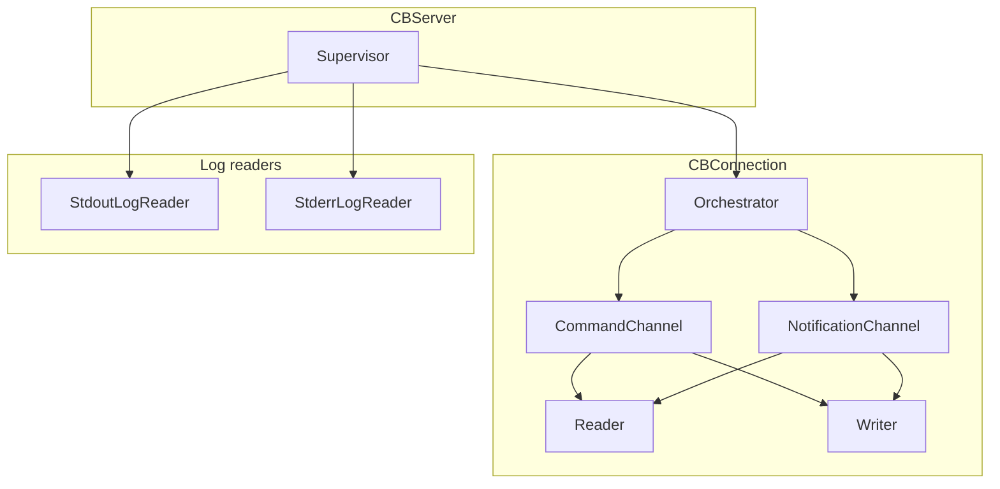

# CBServer State Machine Analysis Report

Analysis of all ihsm actors under `packages/server/src/cbserver/`.

**Status:** analysis only — no source changes.

---

## Scope

| Actor | File | Leaf states |
|-------|------|-------------|
| **CBServer** (supervisor) | `actors/server/CBServerActor.ts` | 8 |
| **CBConnection** (orchestrator) | `actors/connection/CBServerConnectionActor.ts` | 6 |
| **CBCommandChannel** | `actors/commandChannel/CBCommandChannelActor.ts` | 9 |
| **CBNotificationChannel** | `actors/notificationChannel/CBNotificationChannelActor.ts` | 9 |
| **CBConnectionReader** | `actors/reader/CBConnectionReaderActor.ts` | 4 |
| **CBConnectionWriter** | `actors/writer/CBConnectionWriterActor.ts` | 4 |
| **StderrLogReader** | `actors/stderrLogReader/CBServerStderrReaderActor.ts` | 3 |
| **StdoutLogReader** | `actors/stdoutLogReader/CBServerStdoutLogReaderActor.ts` | 3 |

**Total: 8 actors, 46 leaf states.**

---

## Methodology

### Legend

| Code | Meaning |
|------|---------|
| **U** | Unhandled → `UnhandledEventError` (fatal; hierarchy should make this unreachable) |
| **P** | Parent handles (handler omitted on leaf; inherited via prototype) |
| **E** | Implemented empty / idempotent swallow (`_checkInvariant()` only, or intentional no-op) |
| **G** | Guard throw (`throw new Error(...)`) — handled, not unhandled |
| **B** | Meaningful behaviour (transition, notify chain, I/O, etc.) |

### Unhandled → fatal

All tops extend `ihsm.TopState`, whose default `onUnhandled` **rethrows** `UnhandledEventError`. There are **no** `onUnhandled` overrides in cbserver. Any event with no handler anywhere on the prototype chain **will crash the actor mailbox**.

Handler resolution was verified programmatically (prototype walk, same as ihsm runtime).

### Composite vs leaf states

ihsm auto-descends into `@InitialState` leaves on every `transition()`. In normal operation the **current state is always a leaf**. Composites (`Initialized`, `ProcessObserving`, `CommandTransport`, etc.) exist for shared behaviour; they should not be current unless `restore()` places the actor there deliberately.

---

## Actor network



---

## 1. CBServer (supervisor)

### Hierarchy

```text
CBServerTop
├── Uninitialized *
└── Initialized
    ├── ProcessDetached *
    │   ├── Stopped *
    │   └── ShuttingDown
    ├── ProcessDetaching
    └── ProcessObserving
        ├── Starting *
        │   ├── SpawnPending *
        │   └── SpawnArmed
        └── ProcessActive
            ├── Running *
            └── Stopping
```

### Shared ancestors (design intent)

| Ancestor | Role |
|----------|------|
| **Initialized** | Queries (`subscribeStatus`, `getCurrentStateName`), **E** for `start`/`stop`/stdio when no process, **G** for `createConnection`, **B** for `requestShutdown` |
| **ProcessDetached** | **E** for all process lifecycle events when detached |
| **ProcessObserving** | **B** for IO forwarding to log readers, `stop`→`Stopping`, spawn/detach/stop choreography |
| **ProcessActive** | **B** for `onProcessExit`/`onProcessError`/`onDisconnect`→`doCompleteStop`; **E** for `onConnectionChildClosed` |
| **ProcessDetaching** | **B** for detach interrupt/finalize; **E** for late process/stdio noise |

### Leaf state summary

| State | Primary behaviour | Notable E/P patterns |
|-------|-------------------|----------------------|
| **Uninitialized** | `initialize` → **B** | Everything else **U** (pre-bootstrap guard) ✓ |
| **Stopped** | `start` → **B** (`Starting`) | `stop`/`start`/`requestShutdown` **P→E**; process events **P→E** |
| **ShuttingDown** | `onEntry` reset shutdown | Same idle pattern as Stopped |
| **SpawnPending** | `doStart` spawn + arm | `onFailToStart`/`onDisconnect` **B** abort; `stop` **P→B** (`Stopping`) |
| **SpawnArmed** | TCP probe + promote | Process failure handlers **B**; `doBeginStartup`/`doPromoteRunning` **B** |
| **Running** | `createConnection` **B**; IO **P→B** | `onConnectionChildClosed` **P→E** |
| **Stopping** | Close connections → SIGTERM → grace → complete | Full shutdown chain **B** |
| **ProcessDetaching** | Interrupt log readers → finalize detach | `doDispatchInterrupt`/`doFinalizeDetach` **B** |

### Findings

#### Correct: unhandled as fatal guards

- **Uninitialized**: client `start`/`stop`/`createConnection`/subscriptions → **U** ✓
- Internal `do*` events in idle/detached leaves → **U** ✓ (only posted during active phases)

#### Correct: idempotent empty swallows

- `start()` while already started path: **P→Initialized.start()** = **E**
- `stop()` while **Stopped**: **P→Initialized.stop()** = **E**
- `requestShutdown()` in **Stopped**: sets flag only (**B** on Initialized) — no transition until next stop cycle

#### Risk: late log-line events (U in detached states)

`onStdoutLine` / `onStderrLine` are implemented only on **ProcessObserving**, not on **ProcessDetached** or **ProcessDetaching**.

| State | `onStdoutLine` / `onStderrLine` |
|-------|--------------------------------|
| Stopped, ShuttingDown | **U** |
| ProcessDetaching | **U** |

**Mitigation in place:** `StdoutLogReaderContext.emitLine` / `StderrReaderContext.emitLine` skip posting when `interrupted === true`.

**Residual risk:** a line event already queued in the mailbox before `interrupt()` could still be delivered after transition to **Stopped** / **ProcessDetaching** → **fatal U**. Low probability but real race.

#### Risk: log-reader interrupt acks outside detach

`onStdoutLogReaderInterrupted` / `onStderrLogReaderInterrupted` are **U** in **Running**, **SpawnPending**, **SpawnArmed**.

**Mitigation:** `dispatchInterruptToChildren()` is only called from **ProcessDetaching** (after `doBeginDetach`). Acks should arrive while supervisor is in **ProcessDetaching** or **Stopping** (Stopping also handles them, notes only).

If a child posted an interrupt ack while supervisor is still in **Running**, that would **fatal U**.

#### Stopping choreography

`Stopping` correctly owns: `doCloseAllConnections` → `doStop` → `doSendSigterm` → `doArmKillGrace` → `onKillGraceElapsed` (SIGKILL). `doCompleteStop` inherited from **ProcessObserving** completes teardown.

#### Note: `stop()` while Stopping

`stop()` **P→ProcessObserving.stop()** → `transition(Stopping)` may **re-enter** `Stopping.onEntry` (re-close connections). Behaviourally safe but not a pure **E** swallow.

---

## 2. CBConnection (orchestrator)

### Hierarchy

```text
CBConnectionTop
├── ConnectionUninitialized *
├── Connecting
├── ConnectionIdle *
├── ConnectionClosing
└── ConnectionTerminal
    ├── ConnectionClosed
    └── ConnectionBroken
```

### Shared ancestor: ConnectionBase

- All `dispatch*` → **G** via `rejectCommand()` when not idle
- Channel lifecycle internals (`doFinalizeClose`, `onCommandChannelClosed`, etc.) → **B**
- `close()` → **G** ("connection is not ready") except where overridden

### Leaf state summary

| State | Key handlers |
|-------|--------------|
| **ConnectionUninitialized** | `initialize` **B** → Connecting |
| **Connecting** | `doSpawnChannels` **B** (spawn + bootstrap both channels) |
| **ConnectionIdle** | `close` **B**; all `dispatch*` **B** (bridge to channel children) |
| **ConnectionClosing** | `close` **E**; `onEntry` closes channels **B** |
| **ConnectionClosed** | `close` **E**; `onEntry` resolves pending **B** |
| **ConnectionBroken** | `close` **E**; `onEntry` rejects pending **B** |

### Findings

#### Correct

- Commands before bootstrap: **G** (not U) — deliberate API error
- `doSpawnChannels` **U** outside Connecting ✓
- Terminal states: `close` **E** (idempotent)

#### `dispatch*` in ConnectionIdle

Requires `ctx.pendingCommand` / `ctx.pendingNotification`; missing waiter → **G** (`throw new Error("no pending command waiter")`). Correct contract enforcement.

#### Note

`ConnectionClosing` does not block `dispatch*` at orchestrator level (**P→G**). Clients should not dispatch while closing; late dispatch gets **G**, not **U**.

---

## 3. CBCommandChannel

### Hierarchy

```text
CBCommandChannelTop
├── CommandUninitialized *
├── CommandConnecting
├── CommandTransport
│   ├── CommandSession
│   │   └── CommandIdle *
│   ├── RequestProcessing
│   │   ├── Writing
│   │   └── Reading
│   └── CommandClosing
└── CommandTerminal
    ├── CommandDetaching
    ├── CommandClosed
    └── CommandBroken
```

### Shared ancestors

| Ancestor | Role |
|----------|------|
| **CommandChannelBase** | Socket → reader; break/close transport **B**; `dispatch*` **G** when not ready |
| **CommandTransport** | Request queue pipeline (`doProcessNext` → Writing → Reading) **B** |
| **CommandTerminal** | **E** swallows for **all** late socket/reader/writer/internal events |

### Leaf state summary

| State | Role |
|-------|------|
| **CommandUninitialized** | `initialize` **B** |
| **CommandConnecting** | `doConnect` / `doSpawnTcpChildren` / `doBeginEnroll` **B** |
| **CommandIdle** | All `dispatch*` **B** via `dispatchIpc`; `close` **B** |
| **Writing** | Inherits transport write phase **P→B** |
| **Reading** | Overrides `onSocketEnd`/`onSocketClose` → reader `onEnd` **B** (not break) |
| **CommandClosing** | CANCEL_ME or finalize **B**; `close` **E** |
| **CommandDetaching** | Child interrupt + finalize **B** |
| **CommandClosed** / **CommandBroken** | Terminal; late events **P→E**; `dispatch*` **G** |

### Findings

#### Terminal pattern

**CommandTerminal** explicitly **E**-swallows every late event (`onSocket*`, `onReader*`, `onWriter*`, all `do*`). This prevents teardown races from becoming **U**. Same pattern on **NotificationTerminal**.

#### Busy guard

`RequestProcessing.close()` → **G** ("channel is busy") — not U.

#### Reading vs base socket close

**Reading** routes benign socket end to reader instead of `doBreakTransport` — correct for in-flight IPC answer.

#### Note: break vs detach paths

- `doBreakTransport` → **CommandBroken** (immediate, children destroyed)
- `doFinalizeClose` → **CommandDetaching** → **CommandClosed** (graceful CANCEL_ME path)

---

## 4. CBNotificationChannel

### Hierarchy

```text
CBNotificationChannelTop
├── NotificationUninitialized *
├── NotificationConnecting
├── NotificationTransport
│   ├── NotificationEnrolling / NotificationEnrollReading
│   ├── NotificationSession
│   │   ├── NotificationIdle *
│   │   └── NotificationAwaiting
│   └── NotificationClosing
└── NotificationTerminal
    ├── NotificationDetaching
    ├── NotificationClosed
    └── NotificationBroken
```

### Leaf state summary

| State | Role |
|-------|------|
| **NotificationUninitialized** | `initialize` **B** |
| **NotificationConnecting** | connect + spawn + enroll kickoff **B** |
| **NotificationEnrollReading** | Awaiting ENROLL_ME answer; socket end → reader **B** |
| **NotificationIdle** | `beginGetNotification` **B**; push/dequeue **B** |
| **NotificationAwaiting** | Blocks `close` **G**; reader answer **B** |
| **NotificationClosing** | CANCEL_ME write **B**; `close` **E** |
| **NotificationDetaching** | Interrupt children **B** (only used from broken/detach edge) |
| **NotificationClosed** / **NotificationBroken** | Terminal **P→E**; `beginGetNotification` **G** |

### Findings

#### Correct

- **NotificationAwaiting.close** → **G** (cannot close while waiting) ✓
- Spontaneous `onReaderNotification` while idle → queue or resolve waiter **B**

#### Architectural asymmetry (not a bug, worth documenting)

| Path | Command channel | Notification channel |
|------|-----------------|----------------------|
| Normal `close` | `CommandClosing` → CANCEL_ME → **CommandDetaching** → Closed | `NotificationClosing` → CANCEL_ME → **`doFinalizeClose` → Closed directly** |
| Break | → **CommandBroken** | → **NotificationBroken** |

Notification normal close **skips NotificationDetaching**. **NotificationTerminal** still **E**-swallows late events, so no **U** risk.

#### `onNotificationReady` only on NotificationIdle

**NotificationAwaiting** does not handle `onNotificationReady` — relies on `onReaderNotification` / `onReaderAnswer` instead. A stray `onNotificationReady` post in Awaiting → **U**. Not posted by current code paths.

---

## 5. CBConnectionReader (TCP IPC framing)

### Hierarchy

```text
CBConnectionReaderTop
├── ReaderUninitialized *
└── ReaderInitialized
    ├── ReaderIdle *
    ├── ReaderAwaiting
    └── ReaderIgnored
        └── ReaderStopped
```

### Leaf summary

| State | Handlers |
|-------|----------|
| **ReaderUninitialized** | `initialize` **B**; `interrupt` **B** (post ack, no transition) |
| **ReaderIdle** | `onData`/`onEnd`/`onStreamClose` **B**; `beginAwait` **B** → Awaiting |
| **ReaderAwaiting** | Read loop **B**; `onAnswerReady` **B** → Idle |
| **ReaderStopped** | All stream events **P→E** (ReaderIgnored) |

### Findings

#### Correct

- **ReaderStopped** ignores late data — **E** via **ReaderIgnored**
- `beginAwait` while not idle: **ReaderInitialized** throws **G**; **ReaderIgnored** **E**

#### `onStreamClose` in ReaderAwaiting → U

Channel actors post `onSocketEnd` → `reader.notify.onEnd()`, **not** `onStreamClose`. `onStreamClose` is only used by **stdout/stderr log readers** (supervisor path). **Unreachable for this actor in production**; would **U** if posted.

#### ReaderUninitialized stream events → U

Correct pre-init guard; supervisor always `await initialize()` before wiring.

---

## 6. CBConnectionWriter

### Hierarchy

```text
CBConnectionWriterTop
├── WriterUninitialized *
└── WriterInitialized
    ├── WriterIdle *
    ├── WriterSending
    └── WriterIgnored
        └── WriterStopped
```

### Leaf summary

| State | Handlers |
|-------|----------|
| **WriterUninitialized** | `initialize` **B**; `interrupt` **B** |
| **WriterIdle** | `sendFrame` **B** → Sending |
| **WriterSending** | `doWriteFrame` **B**; completions **B** |
| **WriterStopped** | `sendFrame` **P→E**; late completions **U** (writer child destroyed) |

### Findings

#### Correct

- `sendFrame` while sending: **P→WriterInitialized** → **G** ("writer is not idle")
- **WriterStopped.sendFrame** **E** (late write after interrupt)

#### Late `onWriteComplete` in WriterStopped → U

Mitigated: channel `doBreakTransport`/`doFinalizeClose` clears children before terminal. **CommandTerminal** also **E**-swallows `onWriterComplete`.

---

## 7. StderrLogReader & StdoutLogReader

Mirror structure; stderr exposes `getCurrentStateName` service.

### Leaf summary

| State | Handlers |
|-------|----------|
| **Uninitialized** | `initialize` **B**; `stop` **E**; `interrupt` **B** |
| **Idle** | `onData`/`onEnd`/`onStreamClose` **B** (line split + emit) |
| **Stopped** | All stream events **E**; `onEntry` posts interrupt ack **B** |

### Findings

#### Correct

- **Stopped** ignores further stderr/stdout — **E**
- `stop`/`interrupt` from **Uninitialized**: **E** / **B** respectively
- Stream events before `initialize` → **U** ✓

#### Supervisor forwarding

Supervisor **ProcessObserving** forwards `onStdoutClose` → `reader.notify.onStreamClose()` (not used for TCP channel readers).

---

## Cross-cutting patterns (well applied)

| Pattern | Where | Effect |
|---------|-------|--------|
| **Terminal swallow layer** | `CommandTerminal`, `NotificationTerminal` | Late socket/child events → **E**, never **U** |
| **Detached swallow layer** | `ProcessDetached`, `Initialized` stdio | No process → **E** |
| **Guard throws** | `ConnectionBase`, `CommandChannelBase`, not-ready dispatches | Client error, not actor crash |
| **Internal-only events** | All `do*` | **U** outside owning phase — catches scheduling bugs |
| **Interrupt before post** | Log reader `emitLine`, reader `postAnswer` | Reduces late-event surface |

---

## Issues summary

| Severity | Issue | States affected | If triggered |
|----------|-------|-----------------|--------------|
| **Medium** | `onStdoutLine` / `onStderrLine` unhandled | Stopped, ShuttingDown, ProcessDetaching | Late mailbox line after interrupt → **fatal U** |
| **Low** | Log-reader interrupt acks unhandled | Running, SpawnPending, SpawnArmed | Mis-timed `on*LogReaderInterrupted` → **fatal U** |
| **Low** | `onStreamClose` unhandled | ReaderAwaiting | Only if wrongly posted → **fatal U** |
| **Low** | `sendFrame` unhandled | WriterUninitialized | Call before `initialize` → **fatal U** (factories await init) |
| **Info** | `stop()` re-enters Stopping | Stopping | Re-runs close choreography (safe) |
| **Info** | Notification close skips Detaching | NotificationClosing | By design; terminal layer absorbs late events |

**No cases found** where an event that routinely arrives in a leaf state lacks any handler **and** is not covered by a terminal/detached swallow layer — except the late-event races above.

---

## Unhandled-fatal requirement: verdict

| Requirement | Status |
|-------------|--------|
| All true unhandled events throw | **PASS** — default `TopState.onUnhandled` throws; no overrides |
| Hierarchy makes illegal events unreachable | **MOSTLY PASS** — internal `do*` correctly **U** outside owning phases |
| Idempotent commands swallowed | **PASS** — `start`/`stop`/terminal `close`/detached process events |
| Parent delegation used | **PASS** — heavy use of **Initialized**, **ProcessObserving**, **CommandTransport**, **CommandTerminal** |
| Terminal teardown safe | **PASS** — `*Terminal` states comprehensively **E**-swallow |

---

## Recommended follow-ups

1. Add **E** handlers for `onStdoutLine` / `onStderrLine` on **ProcessDetached** (or **Initialized**) to harden against mailbox races during detach/stop.
2. Add **E** handlers for `onStdoutLogReaderInterrupted` / `onStderrLogReaderInterrupted` on **ProcessObserving** (or **Initialized**) as a belt-and-suspenders guard.
3. Add **E** `onStreamClose` on **ReaderAwaiting** for symmetry with **ReaderIdle** (defensive; channel does not post it today).
4. Consider pure **E** `stop()` override on **Stopping** to avoid re-entry side effects.
5. Add ihsm coverage tests (`makeTestActor`) asserting **UnhandledEventError** for representative illegal (state × event) pairs — especially pre-`initialize` client calls.

---

## Coverage reference

```
8 actors × 46 leaf states × ~6–40 events each
≈ 500+ (state × event) combinations analyzed
~200+ theoretically U (by design for wrong-phase internal events)
~6 realistic late-event race surfaces flagged
```
